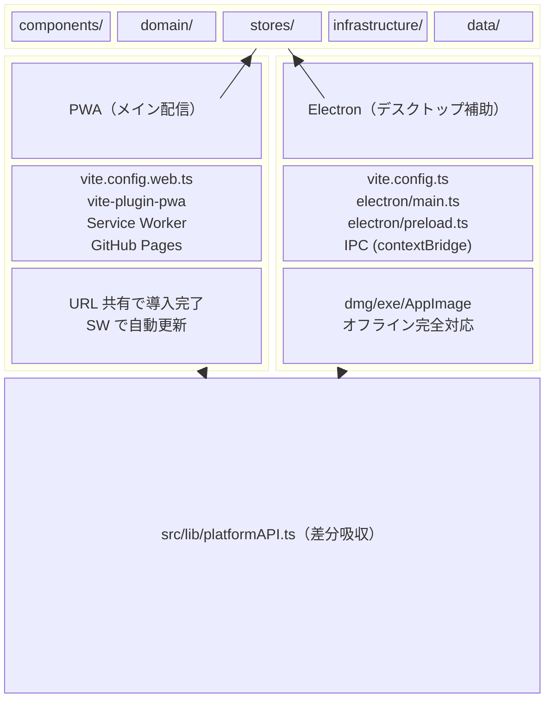
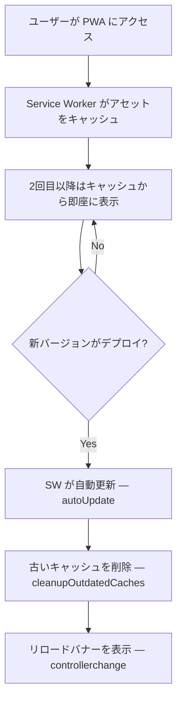
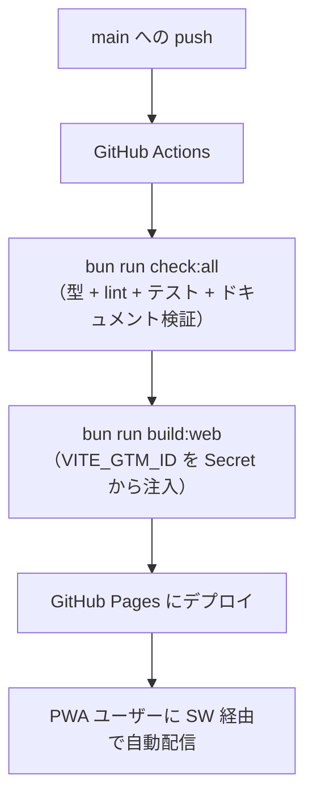
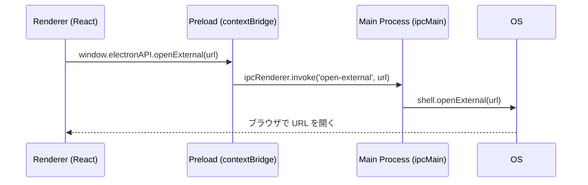
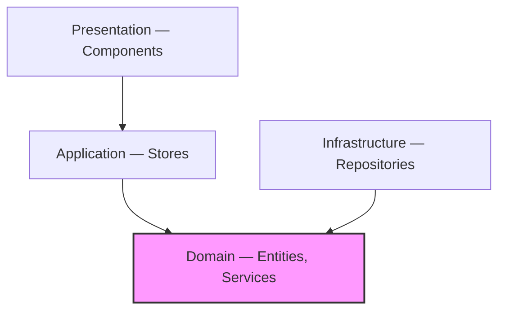

# アーキテクチャ

Claude Code Quiz のアーキテクチャと設計思想について説明します。
各技術選定の背景と理由は [設計判断の記録（ADR）](decisions.md) を参照。

## 目次

- [全体構成](#全体構成)
- [PWA アーキテクチャ](#pwa-アーキテクチャ)
- [Electron アーキテクチャ](#electron-アーキテクチャ)
- [ドメイン駆動設計（DDD）](#ドメイン駆動設計ddd)
- [状態管理](#状態管理)
- [技術スタック](#技術スタック)
- [セキュリティ](#セキュリティ)

## 全体構成

PWA（GitHub Pages）がメインの配信手段。Electron はデスクトップ用の補助。
コードベースは 1 つで、`src/lib/platformAPI.ts` がプラットフォーム差分を吸収する。



## PWA アーキテクチャ

### Service Worker とオフライン対応

`vite-plugin-pwa` が Service Worker を自動生成し、アセットとクイズデータをプリキャッシュする。



### デプロイフロー



### ビルド設定の分離

| 設定ファイル | 用途 | PWA 固有の設定 |
|-------------|------|---------------|
| `vite.config.web.ts` | PWA ビルド | vite-plugin-pwa, base path, manifest |
| `vite.config.ts` | Electron ビルド | electron-vite プラグイン |

### プラットフォーム抽象化

```typescript
// src/lib/platformAPI.ts
export const isElectron = !!window.electronAPI
export const platformAPI = isElectron ? electronAPI : webAPI
```

Electron 固有の機能（ファイル I/O、ネイティブダイアログ等）は `platformAPI` 経由でアクセスし、PWA では Web API にフォールバックする。

## Electron アーキテクチャ

### プロセス分離

Electron は 2 つのプロセスで構成されます：

| プロセス | 役割 | 技術 |
|---------|------|------|
| **Main** | OS との対話、ウィンドウ管理 | Node.js |
| **Renderer** | UI 描画、ユーザー操作 | Chromium + React |

### IPC（プロセス間通信）

Main と Renderer は直接通信できません。Preload スクリプトが橋渡しをします：



### ファイル構成

```
electron/
├── main.ts      # Main プロセスのエントリーポイント
│                # - BrowserWindow 作成
│                # - IPC ハンドラー定義
│                # - セキュリティ設定
│
└── preload.ts   # Preload スクリプト
                 # - contextBridge で API を公開
                 # - Renderer から呼び出せる関数を定義
```

### セキュリティ設定

```typescript
// electron/main.ts
new BrowserWindow({
  webPreferences: {
    nodeIntegration: false,    // Renderer で Node.js 使用不可
    contextIsolation: true,    // コンテキスト分離
    sandbox: true,             // サンドボックス化
    webSecurity: true,         // 同一オリジンポリシー有効
  }
})
```

## ドメイン駆動設計（DDD）

### レイヤー構成

```
src/
├── domain/              # ドメイン層（最も重要）
│   ├── entities/        # エンティティ
│   ├── valueObjects/    # 値オブジェクト
│   ├── services/        # ドメインサービス
│   └── repositories/    # リポジトリインターフェース
│
├── infrastructure/      # インフラ層
│   ├── persistence/     # 永続化実装
│   └── validation/      # バリデーション
│
├── stores/              # アプリケーション層
│   └── quizStore.ts     # Zustand ストア
│
└── components/          # プレゼンテーション層
    └── *.tsx            # React コンポーネント
```

### 依存関係の方向



**重要**: Domain 層は他の層に依存しません（矢印の方向に注目）。

### エンティティ

識別子を持つオブジェクト。ライフサイクルを通じて同一性を保ちます。

```typescript
// src/domain/entities/Question.ts
export class Question {
  readonly id: string
  readonly category: string
  readonly difficulty: DifficultyLevel  // 'beginner' | 'intermediate' | 'advanced'
  readonly question: string
  readonly options: readonly QuizOption[]
  readonly correctIndex: number
  readonly explanation: string
  readonly referenceUrl?: string

  static create(props: QuestionProps): Question { ... }

  isCorrectAnswer(index: number): boolean {
    return this.correctIndex === index
  }
}
```

### 値オブジェクト

識別子を持たず、属性で比較されるオブジェクト。

```typescript
// src/domain/valueObjects/Difficulty.ts
export class Difficulty {
  readonly id: DifficultyLevel
  readonly name: string
  readonly color: string

  static create(props: DifficultyProps): Difficulty { ... }
  static fromId(id: DifficultyLevel): Difficulty { ... }

  isHarderThan(other: Difficulty): boolean {
    const order: DifficultyLevel[] = ['beginner', 'intermediate', 'advanced']
    return order.indexOf(this.id) > order.indexOf(other.id)
  }
}

// 定義済みの難易度
export const PREDEFINED_DIFFICULTIES: Difficulty[] = [
  Difficulty.create({ id: 'beginner', name: '初級', color: '#22C55E' }),
  Difficulty.create({ id: 'intermediate', name: '中級', color: '#F59E0B' }),
  Difficulty.create({ id: 'advanced', name: '上級', color: '#EF4444' }),
]
```

### ドメインサービス

エンティティに属さないビジネスロジック。

```typescript
// src/domain/services/QuizSessionService.ts
export class QuizSessionService {
  selectQuestions(
    allQuestions: Question[],
    mode: QuizMode,
    count: number
  ): Question[] {
    // モードに応じた問題選択ロジック
  }

  calculateScore(answers: Answer[]): QuizResult {
    // スコア計算ロジック
  }
}
```

### リポジトリ

データの永続化を抽象化。

```typescript
// src/domain/repositories/IProgressRepository.ts
export interface IProgressRepository {
  load(): Promise<UserProgress>
  save(progress: UserProgress): Promise<void>
  reset(): Promise<void>
  export(): Promise<string>
  import(jsonString: string): Promise<boolean>
}

// src/infrastructure/persistence/LocalStorageProgressRepository.ts
export class LocalStorageProgressRepository implements IProgressRepository {
  async load(): Promise<UserProgress> {
    const stored = localStorage.getItem(STORAGE_KEY)
    // バリデーション付きでロード
    return stored ? UserProgress.create(result.data) : UserProgress.empty()
  }

  async save(progress: UserProgress): Promise<void> {
    localStorage.setItem(STORAGE_KEY, JSON.stringify(progress.toJSON()))
  }
}
```

## 状態管理

### Zustand の選択理由

- **シンプル**: Redux より少ないボイラープレート
- **TypeScript フレンドリー**: 型推論が優秀
- **React 外でも使用可能**: ドメインサービスからアクセス可能
- **軽量**: バンドルサイズが小さい

### ストア構成

```typescript
// src/stores/quizStore.ts
interface QuizState {
  // 状態
  questions: Question[]
  currentIndex: number
  answers: Answer[]
  progress: UserProgress

  // アクション
  startQuiz: (mode: QuizMode) => void
  submitAnswer: (index: number) => void
  nextQuestion: () => void
  finishQuiz: () => void
}

export const useQuizStore = create<QuizState>((set, get) => ({
  // 実装
}))
```

### セレクターパターン

不要な再レンダリングを防ぐため、必要な状態のみを購読：

```typescript
// Bad: 全状態を購読
const state = useQuizStore()

// Good: 必要な状態のみ購読
const currentQuestion = useQuizStore(state => state.questions[state.currentIndex])
const submitAnswer = useQuizStore(state => state.submitAnswer)
```

## 技術スタック

| カテゴリ | 技術 | 選択理由 |
|---------|------|----------|
| フレームワーク | Electron | デスクトップアプリ、クロスプラットフォーム |
| ビルドツール | Vite | 高速な開発サーバー、HMR |
| UI | React | コンポーネント指向、エコシステム |
| 言語 | TypeScript | 型安全性、IDE サポート |
| スタイル | Tailwind CSS | ユーティリティファースト、カスタマイズ性 |
| 状態管理 | Zustand | シンプル、軽量 |
| バリデーション | Zod | スキーマ定義、型推論 |
| テスト | Vitest | Vite ネイティブ、Jest 互換 |

## セキュリティ

### Electron セキュリティベストプラクティス

1. **nodeIntegration: false**
   - Renderer で Node.js API を使用不可
   - XSS 攻撃があっても Node.js API にアクセス不可

2. **contextIsolation: true**
   - Preload と Renderer のグローバルオブジェクトを分離
   - Prototype pollution 攻撃を防止

3. **sandbox: true**
   - Renderer をサンドボックス内で実行
   - ファイルシステムへの直接アクセスを禁止

4. **Content Security Policy**
   ```html
   <meta http-equiv="Content-Security-Policy"
         content="default-src 'self'; script-src 'self'; style-src 'self' 'unsafe-inline';">
   ```

### IPC セキュリティ

```typescript
// Main: HTTPS のみ許可
ipcMain.handle('open-external', async (event, url: string) => {
  const parsedUrl = new URL(url)
  if (parsedUrl.protocol !== 'https:') {
    return false  // HTTP を拒否
  }
  await shell.openExternal(url)
  return true
})
```

### データバリデーション

```typescript
// Zod スキーマで入力を検証
const QuizDataSchema = z.object({
  title: z.string(),
  quizzes: z.array(QuestionSchema)
})

// インポート時に検証
const result = QuizDataSchema.safeParse(importedData)
if (!result.success) {
  throw new ValidationError(result.error)
}
```

---

開発の詳細については [DEVELOPMENT.md](./DEVELOPMENT.md) を参照してください。
