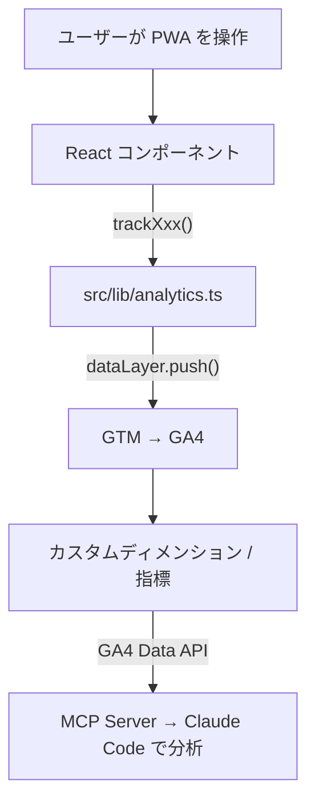

# アナリティクス イベント定義

PWA のユーザー操作から GA4 に送信されるイベントの一覧と、データの流れ。

## データフロー



## 共通パラメータ

全イベントに自動付与:

| パラメータ | 型 | 値 | 説明 |
|-----------|-----|-----|------|
| `platform` | string | `pwa` / `electron` | 配信プラットフォーム。大半のユーザーは `pwa`（GitHub Pages 経由） |

## イベント一覧

### tutorial_progress

初回訪問時のチュートリアル画面（Claude Code の紹介）の完了またはスキップ。

| パラメータ | 型 | 値 |
|-----------|-----|-----|
| `action` | string | `complete` / `skip` |
| `slide_index` | number | スキップ時のスライド番号（0始まり） |

**送信元:** `src/components/Layout/TutorialScreen.tsx`

**分析用途:** 初回ユーザーの離脱を防ぐチュートリアルが有効か。スキップ率が高い場合はコンテンツ改善が必要。

### quiz_start

クイズセッションの開始。

| パラメータ | 型 | 値 |
|-----------|-----|-----|
| `quiz_mode` | string | `overview`, `full`, `category`, `random`, `quick`, `weak`, `bookmark`, `review`, `scenario`, `custom`, `unanswered` |
| `question_count` | number | セッションの問題数 |
| `category` | string? | カテゴリ別学習時のカテゴリ ID |

**送信元:** `src/stores/quizStore.ts` (`startSession`)

**分析用途:** どのモードが人気か。初心者は `overview` を選んでいるか。スマホユーザーは `quick`（60秒チェック）を好むか。

### quiz_complete

クイズセッションの完了。

| パラメータ | 型 | 値 |
|-----------|-----|-----|
| `quiz_mode` | string | 開始時と同じモード |
| `score` | number | 正解数 |
| `total` | number | 回答した問題数 |
| `accuracy` | number | 正答率（0-100） |
| `duration_sec` | number | セッション所要時間（秒） |

**送信元:** `src/stores/quizStore.ts` (`recordCompletedSession`)

**分析用途:** モード別の正答率・完了率。`quiz_start` と比較して途中離脱率を算出。スマホでの所要時間が PC より長いか。

### chapter_progress

全体像モード（初心者向け6チャプター構成）のチャプター開始。

| パラメータ | 型 | 値 |
|-----------|-----|-----|
| `chapter_id` | number | チャプター番号（1-6） |
| `action` | string | `start` / `complete` |
| `accuracy` | number? | 完了時の正答率 |

**送信元:** `src/components/Quiz/ChapterIntro.tsx`

**分析用途:** どのチャプターで初心者が挫折するか。チャプター導入画面の効果測定。

### study_first

「読んでから解く」モード（解説を先に読んでからクイズに挑戦する初心者向けフロー）。

| パラメータ | 型 | 値 |
|-----------|-----|-----|
| `chapter_id` | number | チャプター番号 |
| `action` | string | `start_reading` / `finish_reading` / `start_quiz` |

**送信元:** `src/components/Menu/StudyFirstView.tsx`

**分析用途:** このモードの利用率。解説を読んだ後にクイズに進む率（`finish_reading` → `start_quiz`）。

### bookmark

ブックマーク操作。

| パラメータ | 型 | 値 |
|-----------|-----|-----|
| `action` | string | `add` / `remove` |

**送信元:** 未接続（将来実装）

### quiz_search

キーワード検索の利用。

| パラメータ | 型 | 値 |
|-----------|-----|-----|
| `result_count` | number | 検索結果件数 |

**送信元:** 未接続（将来実装）

### reader_open

解説リーダー（クイズなしで解説を閲覧する機能）の利用。

**送信元:** 未接続（将来実装）

### share_result

Web Share API によるクイズ結果のシェア。

| パラメータ | 型 | 値 |
|-----------|-----|-----|
| `method` | string | `clipboard`, `share_api` 等 |

**送信元:** 未接続（将来実装）

### certificate_download

修了証（全体像モード 70%+ / 実力テスト 80%+ で発行）のダウンロード。

| パラメータ | 型 | 値 |
|-----------|-----|-----|
| `quiz_mode` | string | `overview` / `full` |

**送信元:** 未接続（将来実装）

## GA4 カスタム定義

### カスタムディメンション

| ディメンション名 | パラメータ名 | 範囲 | 用途 |
|-----------------|-------------|------|------|
| プラットフォーム | `platform` | イベント | PWA（スマホ/PC）の利用比率 |
| クイズモード | `quiz_mode` | イベント | モード別の人気・完了率 |
| カテゴリ | `category` | イベント | カテゴリ別の学習傾向 |
| アクション | `action` | イベント | 完了/スキップ等の区分 |
| チャプター | `chapter_id` | イベント | チャプター別の進捗・離脱 |

### カスタム指標

| 指標名 | パラメータ名 | 測定単位 | 用途 |
|--------|-------------|---------|------|
| 正答率 | `accuracy` | 標準 | 学習効果の測定 |
| スコア | `score` | 標準 | 正解数の集計 |
| 所要時間 | `duration_sec` | 秒 | スマホでの学習時間 |
| 問題数 | `question_count` | 標準 | セッション規模 |

## イベント追加手順

新しいイベントを追加する場合:

### 1. イベント定義を追加

`gtm/events.json`:
```json
{
  "name": "new_event_name",
  "description": "イベントの説明",
  "params": ["param1", "param2", "platform"]
}
```

### 2. TypeScript 関数を追加

`src/lib/analytics.ts`:
```typescript
export function trackNewEvent(param1: string, param2: number): void {
  pushEvent('new_event_name', { param1, param2 })
}
```

### 3. コンポーネントから呼び出し

```typescript
import { trackNewEvent } from '@/lib/analytics'
trackNewEvent('value1', 42)
```

### 4. GTM に反映

```bash
node gtm/deploy-gtm.mjs --apply
```

### 5. GA4 カスタムディメンション（必要な場合）

`gtm/setup-ga4.mjs` にディメンション/指標を追加して再実行:
```bash
node gtm/setup-ga4.mjs <property-id>
```

### 6. デプロイ

`main` に push すれば GitHub Actions が自動でビルド・デプロイ。PWA ユーザーは Service Worker の更新で自動反映。
