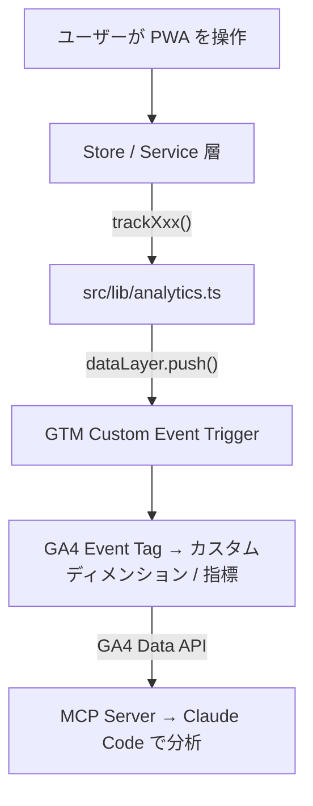

# アナリティクス イベント定義

PWA のユーザー操作から GA4 に送信されるイベントの一覧と、データの流れ。
API/MCP 経由でこのデータをクエリする方法は [analytics-api-guide.md](analytics-api-guide.md) を参照。

## データフロー



## 計測の原則

- **store/service 層から dataLayer push** — コンポーネントの onClick に直接トラッキングコードを入れない
- **GTM Custom Event trigger** — 全イベントが `dataLayer.push({ event: 'xxx' })` → GTM trigger → GA4 tag の統一パターン
- ビジネスロジック系（answer, quit, resume, bookmark, search）→ Zustand store slice
- ユーティリティ系（theme）→ lib 関数内
- 非同期完了系（share）→ Promise の `.then()` コールバック

## 共通パラメータ

全イベントに自動付与:

| パラメータ | 型 | 値 | 説明 |
|-----------|-----|-----|------|
| `platform` | string | `pwa` / `electron` | 配信プラットフォーム。大半のユーザーは `pwa`（GitHub Pages 経由） |

## イベント一覧

### tutorial_progress

初回訪問時のチュートリアル画面（Claude Code の紹介）の完了またはスキップ。

| パラメータ | 型 | 値 |
|-----------|-----|-----|
| `action` | string | `complete` / `skip` |
| `slide_index` | number | スキップ時のスライド番号（0始まり） |

**送信元:** `src/components/Layout/TutorialScreen.tsx`

**分析用途:** 初回ユーザーの離脱を防ぐチュートリアルが有効か。スキップ率が高い場合はコンテンツ改善が必要。

### quiz_start

クイズセッションの開始。

| パラメータ | 型 | 値 |
|-----------|-----|-----|
| `quiz_mode` | string | `overview`, `full`, `category`, `random`, `quick`, `weak`, `bookmark`, `review`, `scenario`, `custom`, `unanswered` |
| `question_count` | number | セッションの問題数 |
| `category` | string? | カテゴリ別学習時のカテゴリ ID |

**送信元:** `src/stores/slices/sessionSlice.ts` (`startSession`)

**分析用途:** どのモードが人気か。初心者は `overview` を選んでいるか。スマホユーザーは `quick`（60秒チェック）を好むか。

### quiz_complete

クイズセッションの完了。

| パラメータ | 型 | 値 |
|-----------|-----|-----|
| `quiz_mode` | string | 開始時と同じモード |
| `score` | number | 正解数 |
| `total` | number | 回答した問題数 |
| `accuracy` | number | 正答率（0-100） |
| `duration_sec` | number | セッション所要時間（秒） |

**送信元:** `src/stores/utils.ts` (`recordCompletedSession`)

**分析用途:** モード別の正答率・完了率。`quiz_start` と比較して途中離脱率を算出。スマホでの所要時間が PC より長いか。

### chapter_progress

全体像モード（初心者向け6チャプター構成）のチャプター開始。

| パラメータ | 型 | 値 |
|-----------|-----|-----|
| `chapter_id` | number | チャプター番号（1-6） |
| `action` | string | `start` / `complete` |
| `accuracy` | number? | 完了時の正答率 |

**送信元:** `src/components/Quiz/ChapterIntro.tsx`

**分析用途:** どのチャプターで初心者が挫折するか。チャプター導入画面の効果測定。

### study_first

「読んでから解く」モード（解説を先に読んでからクイズに挑戦する初心者向けフロー）。

| パラメータ | 型 | 値 |
|-----------|-----|-----|
| `chapter_id` | number | チャプター番号 |
| `action` | string | `start_reading` / `finish_reading` / `start_quiz` |

**送信元:** `src/components/Menu/StudyFirstView.tsx`

**分析用途:** このモードの利用率。解説を読んだ後にクイズに進む率（`finish_reading` → `start_quiz`）。

### bookmark

ブックマーク操作。

| パラメータ | 型 | 値 |
|-----------|-----|-----|
| `action` | string | `add` / `remove` |

**送信元:** `src/stores/slices/bookmarkSlice.ts` (`toggleBookmark`)

**分析用途:** ブックマーク機能の利用頻度。add/remove 比率で「後で学ぶ」フローの効果を測定。

### quiz_search

キーワード検索からクイズセッションを開始した回数。

| パラメータ | 型 | 値 |
|-----------|-----|-----|
| `result_count` | number | 検索結果件数 |

**送信元:** `src/stores/slices/sessionSlice.ts` (`startSessionWithIds`)

**分析用途:** 検索機能の利用率。result_count が 0 に近い場合はクイズデータのカバレッジ不足。

### reader_open

解説リーダー（クイズなしで解説を閲覧する機能）の利用。

**送信元:** `src/stores/slices/viewSlice.ts` (`setViewState('reader')`)

**分析用途:** リファレンスとしての利用率。検索やクイズモードとの比較。

### share_result

Web Share API によるクイズ結果のシェア（成功時のみ計測）。

| パラメータ | 型 | 値 |
|-----------|-----|-----|
| `method` | string | `native`（Web Share API） |

**送信元:** `src/components/Quiz/QuizResult.tsx`（`navigator.share().then()`）

**分析用途:** シェア機能の利用率。バイラル効果の測定。

### certificate_download

修了証（全体像モード 70%+ / 実力テスト 80%+ で発行）のダウンロード。

| パラメータ | 型 | 値 |
|-----------|-----|-----|
| `quiz_mode` | string | `overview` / `full` |

**送信元:** `src/components/Quiz/result/CertificateGenerator.tsx` (`handleGenerate`)

**分析用途:** 修了証機能の利用率。モード別の達成率。

### quiz_answer

個別の問題回答。正誤・カテゴリ・難易度をトラッキング。

| パラメータ | 型 | 値 |
|-----------|-----|-----|
| `question_id` | string | 問題 ID（例: `mem-001`） |
| `category` | string | カテゴリ ID |
| `difficulty` | string | `beginner` / `intermediate` / `advanced` |
| `is_correct` | boolean | 正解かどうか |

**送信元:** `src/stores/slices/sessionSlice.ts` (`submitAnswer`)

**分析用途:** どの問題が難しいか。カテゴリ別正答率の詳細分析。問題品質の改善指標。

### quiz_quit

クイズの途中離脱（完了前に endSession が呼ばれた場合）。

| パラメータ | 型 | 値 |
|-----------|-----|-----|
| `quiz_mode` | string | 離脱したモード |
| `answered_count` | number | 回答済み問題数 |
| `total_questions` | number | セッション全体の問題数 |

**送信元:** `src/stores/slices/sessionSlice.ts` (`endSession`)

**分析用途:** どのモードで離脱が多いか。何問目で離脱するか（ファネル改善の鍵）。

### theme_change

ダーク/ライトモードの切替。

| パラメータ | 型 | 値 |
|-----------|-----|-----|
| `theme` | string | `dark` / `light` / `system` |

**送信元:** `src/lib/theme.ts` (`setStoredTheme`)

**分析用途:** ダークモード利用率。デバイス × テーマの相関。

### session_resume

保存されたセッションへの復帰。

| パラメータ | 型 | 値 |
|-----------|-----|-----|
| `quiz_mode` | string | 復帰したモード |
| `questions_remaining` | number | 残り問題数 |

**送信元:** `src/stores/slices/resumeSlice.ts` (`resumeSession`)

**分析用途:** セッション復帰率。リテンション測定の指標。

### app_error

アプリエラー（未処理例外・レンダリングエラー）。

| パラメータ | 型 | 値 |
|-----------|-----|-----|
| `error_message` | string | エラーメッセージ（200文字以内） |
| `error_source` | string | `react_boundary` / `window_error` / `unhandled_rejection` |

**送信元:**
- `src/components/Layout/ErrorBoundary.tsx`（React レンダリングエラー）
- `src/main.tsx`（グローバル `window.onerror` + `unhandledrejection`）

**分析用途:** 頻出エラーの検出とバグ修正の優先度判断。`/quality-loop` のステップ 0 で最優先チェック。

## GA4 カスタム定義

### カスタムディメンション

| ディメンション名 | パラメータ名 | 範囲 | 用途 |
|-----------------|-------------|------|------|
| プラットフォーム | `platform` | イベント | PWA（スマホ/PC）の利用比率 |
| クイズモード | `quiz_mode` | イベント | モード別の人気・完了率 |
| カテゴリ | `category` | イベント | カテゴリ別の学習傾向 |
| アクション | `action` | イベント | 完了/スキップ等の区分 |
| チャプター | `chapter_id` | イベント | チャプター別の進捗・離脱 |
| エラーメッセージ | `error_message` | イベント | エラー内容の分類 |
| エラーソース | `error_source` | イベント | 発生箇所の特定 |
| 問題ID | `question_id` | イベント | 問題別の正答率分析 |
| 難易度 | `difficulty` | イベント | 難易度別の傾向分析 |
| 正誤 | `is_correct` | イベント | 問題単位の正答率 |
| テーマ | `theme` | イベント | ダーク/ライト利用率 |

### カスタム指標

| 指標名 | パラメータ名 | 測定単位 | 用途 |
|--------|-------------|---------|------|
| 正答率 | `accuracy` | 標準 | 学習効果の測定 |
| スコア | `score` | 標準 | 正解数の集計 |
| 所要時間 | `duration_sec` | 秒 | スマホでの学習時間 |
| 問題数 | `question_count` | 標準 | セッション規模 |
| 回答済み数 | `answered_count` | 標準 | 途中離脱の位置 |
| 残り問題数 | `questions_remaining` | 標準 | 復帰時の残量 |
| 検索結果件数 | `result_count` | 標準 | 検索精度の評価 |

## イベント追加手順

新しいイベントを追加する場合:

### 1. イベント定義を追加

`gtm/events.json`:
```json
{
  "name": "new_event_name",
  "description": "イベントの説明",
  "params": ["param1", "param2", "platform"]
}
```

### 2. TypeScript 関数を追加

`src/lib/analytics.ts`:
```typescript
export function trackNewEvent(param1: string, param2: number): void {
  pushEvent('new_event_name', { param1, param2 })
}
```

### 3. store/service 層から呼び出し

```typescript
// ✅ Zustand store slice で呼ぶ（推奨）
import { trackNewEvent } from '@/lib/analytics'
trackNewEvent('value1', 42)

// ❌ コンポーネントの onClick に直接書かない
```

### 4. GTM に反映

```bash
node gtm/deploy-gtm.mjs --apply
```

### 5. GA4 カスタムディメンション（必要な場合）

`gtm/setup-ga4.mjs` にディメンション/指標を追加して再実行:
```bash
node gtm/setup-ga4.mjs <property-id>
```

### 6. デプロイ

`main` に push すれば GitHub Actions が自動でビルド・デプロイ。PWA ユーザーは Service Worker の更新で自動反映。
