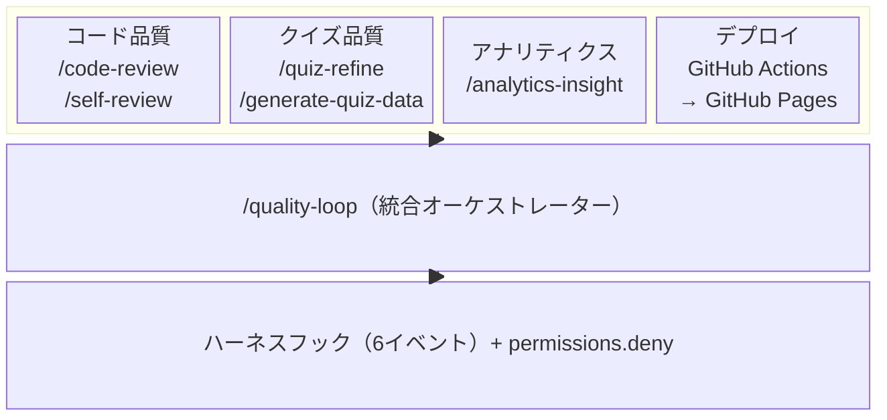
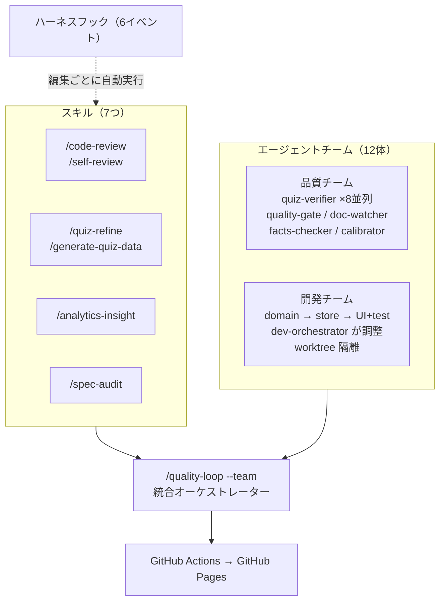

# 自動化ツール一覧

PWA のビルド・デプロイ・品質管理・アナリティクスを支える自動化ツールの全体像。
日常の開発でこれらをどう使い分けるかは [Claude Code 活用ワークフロー](claude-code-workflow.md) を参照。

## 全体像



## スキル（Claude Code スラッシュコマンド）

### /quality-loop — 品質改善の統合実行

| 項目 | 内容 |
|------|------|
| 実行内容 | GA4分析 → コードレビュー → クイズ追加判定 → クイズ検証 |
| 定義 | `.claude/skills/quality-loop/SKILL.md` |
| 定期実行 | `/loop 1h /quality-loop` |

### /analytics-insight — GA4 ユーザー行動分析

| 項目 | 内容 |
|------|------|
| 分析内容 | PWA ユーザーのファネル、モード利用率、離脱率、正答率 |
| 依存 | GA4 MCP サーバー（`mcp/ga4-server.mjs`） |
| 定義 | `.claude/skills/analytics-insight/SKILL.md` |

### /code-review — 多層コード品質レビュー

| 項目 | 内容 |
|------|------|
| 定義 | `~/.claude/skills/code-review/SKILL.md`（ユーザーレベル） |
| 統合スキル | `/simplify` + `/typescript-react-reviewer` + `/accessibility` + `/performance` |

4つの専門スキルを統合した包括的チェック:

| レイヤー | チェック内容 | 重大度例 |
|---------|------------|---------|
| コード品質 | 重複、不要な複雑さ、効率の悪いパターン | High: N+1ループ |
| React/TS | Hook ルール違反、state mutation、依存配列 | Critical: useEffect内の派生状態 |
| アクセシビリティ | aria-label、フォーカス管理、タップターゲット | High: 48px未満のボタン |
| パフォーマンス | バンドルサイズ、re-render、SW キャッシュ | Suggestion: 仮想スクロール検討 |

Critical は自動修正、High は修正案提示、Suggestion は報告のみ。

### /quiz-refine — クイズ検証・修正

| 項目 | 内容 |
|------|------|
| 内容 | 公式ドキュメントと照合し事実誤りを修正 |
| モード | 差分（デフォルト） / 全問スキャン（`--full`） |
| 定義 | `.claude/skills/quiz-refine/SKILL.md` |

### /generate-quiz-data — クイズ自動生成

| 項目 | 内容 |
|------|------|
| 内容 | 公式ドキュメントからクイズ問題を自動生成 |
| 後処理 | `bun run quiz:post-add` |
| 定義 | `.claude/skills/generate-quiz-data/SKILL.md` |

### /spec-audit — 仕様整合性監査

| 項目 | 内容 |
|------|------|
| 内容 | CLAUDE.md の仕様記述と実装コードの意味的な整合性チェック |
| 定義 | `.claude/skills/spec-audit/SKILL.md` |

## エージェントチーム（`.claude/agents/`）

`--team` フラグやオーケストレーターを通じて並列実行される専門エージェント。12体。

### 品質チーム

| エージェント | モデル | 役割 |
|-------------|--------|------|
| `quiz-verifier` | sonnet | カテゴリ別クイズ検証（最大8並列） |
| `quality-gate` | sonnet | テスト・サイズ品質ゲート |
| `doc-watcher` | sonnet | ドキュメント変更検出・影響分析 |
| `quiz-pipeline` | opus | 生成→検証パイプラインオーケストレーション |
| `facts-checker` | sonnet | MEMORY.md Verified Facts 鮮度チェック |
| `difficulty-calibrator` | sonnet | GA4 正答率と difficulty ラベルの乖離検出 |

### 開発チーム

| エージェント | モデル | スクラムロール | worktree |
|-------------|--------|-------------|----------|
| `dev-orchestrator` | opus | スクラムマスター | なし |
| `domain-developer` | opus | バックエンド開発 | 隔離 |
| `store-developer` | opus | 状態管理開発 | 隔離 |
| `ui-developer` | opus | フロントエンド開発 | 隔離 |
| `test-developer` | sonnet | QA | 隔離 |
| `code-reviewer-agent` | sonnet | テックリード | なし（読取専用） |

### 全体像（更新版）



## GTM / GA4 自動化スクリプト

### gtm/events.json — イベント定義（Single Source of Truth）

PWA から送信する全イベントの定義。他のスクリプトが参照する。

```json
{
  "events": [
    {
      "name": "quiz_start",
      "description": "クイズ開始",
      "params": ["quiz_mode", "question_count", "category", "platform"]
    }
  ]
}
```

### gtm/build-container.mjs — GTM インポート JSON 生成

`events.json` + GTM エクスポート JSON → GTM にインポート可能な JSON を生成。

```bash
node gtm/build-container.mjs path/to/exported.json --import
```

### gtm/deploy-gtm.mjs — GTM API 自動デプロイ

`events.json` の定義を GTM API 経由でコンテナに反映し公開する。

```bash
node gtm/deploy-gtm.mjs          # ドライラン
node gtm/deploy-gtm.mjs --apply  # 適用 & 公開
```

### gtm/setup-ga4.mjs — GA4 ディメンション自動登録

GA4 のカスタムディメンション・指標を API 経由で一括登録。

```bash
node gtm/setup-ga4.mjs                    # プロパティ一覧
node gtm/setup-ga4.mjs <property-id>      # 登録実行
```

## MCP サーバー

### mcp/ga4-server.mjs — GA4 分析データ取得

Claude Code から GA4 Data API に直接クエリできる MCP サーバー。

| ツール | 説明 | 使用例 |
|--------|------|--------|
| `ga4_summary` | 直近 N 日間の KPI サマリー | 「先週のユーザー数は？」 |
| `ga4_report` | カスタムレポート | 「モード別の正答率を教えて」 |
| `ga4_realtime` | リアルタイムデータ | 「今アクティブなユーザーは？」 |

設定: `~/.claude/settings.json` の `mcpServers` に登録済み。

## スクリプト

| コマンド | 説明 |
|---------|------|
| `bun run dev:web` | PWA 開発サーバー起動 |
| `bun run build:web` | PWA プロダクションビルド |
| `bun run preview:web` | ビルド結果のプレビュー |
| `bun run check` | 型 + lint + テスト + 問題チェック |
| `bun run check:all` | check + ドキュメント検証 + クローン検出（CI で使用） |
| `bun run cpd` | コードクローン検出（jscpd、2%以下） |
| `bun run quiz:stats` | カテゴリ・難易度・correctIndex 分布 |
| `bun run quiz:coverage` | ドキュメントページ別カバレッジ |
| `bun run quiz:check` | 構造的品質チェック |
| `bun run quiz:post-add` | 問題追加後の一括処理 |
| `bun run docs:validate` | CLAUDE.md の統計値検証 |

## 主要パッケージ

### ランタイム依存（5パッケージ）

| パッケージ | 用途 |
|-----------|------|
| React 18 + ReactDOM | UI フレームワーク |
| Zustand 4 | 軽量な状態管理（Redux の代替） |
| Zod 3 | クイズデータのスキーマバリデーション |
| Lucide React | SVG アイコン（tree-shakable） |

### ビルド・開発

| パッケージ | 用途 |
|-----------|------|
| Vite 5 | ビルド + HMR 開発サーバー |
| vite-plugin-pwa | Service Worker 生成、PWA マニフェスト |
| Tailwind CSS 3 | ユーティリティファーストの CSS |
| TypeScript 5 | 型安全な開発 |
| Electron 31 | デスクトップアプリ（AI連携・利用履歴レコメンド） |

### テスト・品質チェック

| パッケージ | 用途 |
|-----------|------|
| Vitest 4 | ユニットテスト（jsdom 環境） |
| Playwright | E2E テスト + Visual Regression（7 デバイス） |
| @axe-core/playwright | WCAG 2.1 AA 自動アクセシビリティテスト |
| Biome | Lint + フォーマッター（ESLint + Prettier の代替） |
| type-coverage | TypeScript 型カバレッジ測定（99.5%） |
| size-limit | バンドルサイズ上限チェック |
| Lighthouse CI | Performance / Accessibility / SEO / Best Practices スコア監視 |
| knip | 未使用コード・未使用依存の検出 |
| jscpd | コードクローン（コピペ）検出 |

### アナリティクス・API

| パッケージ | 用途 |
|-----------|------|
| @google-analytics/data | GA4 Data API（MCP サーバーで使用） |
| @google-analytics/admin | GA4 カスタムディメンション自動登録 |
| google-auth-library | GCP サービスアカウント認証（GTM API デプロイ） |

## ハーネスフック（`.claude/settings.json`）

Claude Code セッション中に全6イベントを監視。品質チェック、安全ガード、通知を自動実行。

| フック | タイミング | 内容 | タイムアウト |
|--------|-----------|------|------------|
| SessionStart | セッション開始時 | CI失敗・マージ競合・型エラー・未コミット数 | 15秒 |
| PreToolUse (Bash) | コマンド実行前 | 破壊的コマンド（Git/SQL/デーモン）の事前ブロック（`scripts/pre-tool-check.sh`） | 3秒 |
| PostToolUse Hook 1 | Write/Edit 後 | ファイル種別に応じた品質チェック（後述） | 120秒 |
| PostToolUse Hook 2 | Write/Edit 後 | 重要ファイル変更時の影響範囲アラート | 5秒 |
| UserPromptSubmit | プロンプト送信時 | 2000文字超のプロンプトに分割提案 | 2秒 |
| Notification | 通知発火時 | macOS ネイティブ通知（バックグラウンドタスク完了） | 3秒 |
| Stop | セッション終了時 | 未コミットファイル・型エラー・lintエラー報告 | 15秒 |

### Hook 1: 品質チェック（ファイル種別分岐）

| 対象ファイル | 実行内容 |
|------------|---------|
| `src/components/*.tsx` | tsc + SpecConsistency テスト + vitest（並列） |
| `src/domain/*`, `src/stores/*` | tsc + vitest（並列） |
| `src/config/locale*` | tsc + ハードコード日本語スキャン |
| `scripts/*.mjs` | node --check 構文チェック |
| `*.json` | tsc |
| `docs/*`, `*.md` | docs:validate |

### Hook 2: 影響範囲アラート

| 対象ファイル | アラート内容 |
|------------|------------|
| `QuizMode.ts` | name/description と questionCount/timeLimit の一致確認 |
| `UserProgress.ts` | isCorrectlyAnswered() の呼び出し元への影響確認 |
| `ScoreThresholds.ts` | 全画面のスコア表示への影響警告 |
| `SessionRepository.ts` | resumeSlice と saveSnapshot の同時更新確認 |
| `locale.ts` | ja.ts にも翻訳追加が必要か確認 |
| `ja.ts` | locale.ts の型定義も更新が必要か確認 |

詳細: [仕様バグ防止ガイド](bug-prevention.md)

## CI/CD

### GitHub Actions → GitHub Pages

`.github/workflows/deploy.yml`:

```
main への push
  ↓
bun install --frozen-lockfile
  ↓
bun run check:all（型 + lint + テスト + ドキュメント検証）
  ↓
bun run build:web（VITE_GTM_ID を Secret から注入）
  ↓
GitHub Pages にデプロイ
  ↓
PWA ユーザーに Service Worker 経由で自動配信
```

## ファイル構成

```
docs/
├── analytics-setup.md    # セットアップ手順（このガイド群）
├── analytics-events.md   # イベント定義
├── quality-loop.md       # 品質改善ループ
└── automation.md         # 自動化ツール一覧（本ファイル）

gtm/
├── events.json           # イベント定義（SSOT）
├── build-container.mjs   # GTM インポート JSON 生成
├── deploy-gtm.mjs        # GTM API 自動デプロイ
├── setup-ga4.mjs         # GA4 ディメンション自動登録
├── container-config.json  # テンプレート（リポジトリ管理）
├── container-import.json  # インポート用（.gitignore）
└── README.md             # セットアップ手順（簡易版）

scripts/
├── quiz-utils.mjs          # クイズ管理（stats, coverage, check, edit, randomize）
├── collect-session.mjs     # セッション収集 + 前処理（Layer 1: 苦戦シグナル, 意図遷移）
├── session-analysis.mjs    # セッション分析純粋関数（苦戦シグナル + 決定論的メトリクス）
├── classify-prompts.mjs    # Haiku バッチ分類（Layer 2: 意図/カテゴリ/苦戦度 + 苦戦ヒント注入）
├── aggregate-classifications.mjs # 分類結果集計 + 圧縮入力生成（Layer 3）
├── pre-lint-quiz.mjs       # 決定論的 lint 前処理（クイズ検証用、LLM不要）
├── recommend.mjs           # CLI レコメンド生成
├── fetch-docs.mjs          # 公式ドキュメントキャッシュ
├── setup-hooks.mjs         # グローバルフックセットアップ
├── validate-docs.mjs       # CLAUDE.md 統計値検証
└── check-skills.mjs        # スキル・エージェントのベストプラクティスチェック

mcp/
└── ga4-server.mjs        # GA4 MCP サーバー

src/lib/
└── analytics.ts          # イベント送信の抽象レイヤー

.claude/skills/
├── quality-loop/         # 品質改善ループ
├── analytics-insight/    # GA4 分析
├── quiz-refine/          # クイズ検証
├── generate-quiz-data/   # クイズ生成
└── spec-audit/           # 仕様監査

.env.example              # 環境変数テンプレート（リポジトリ管理）
.env                      # 実際の値（.gitignore）
.github/workflows/
└── deploy.yml            # PWA 自動デプロイ
```
