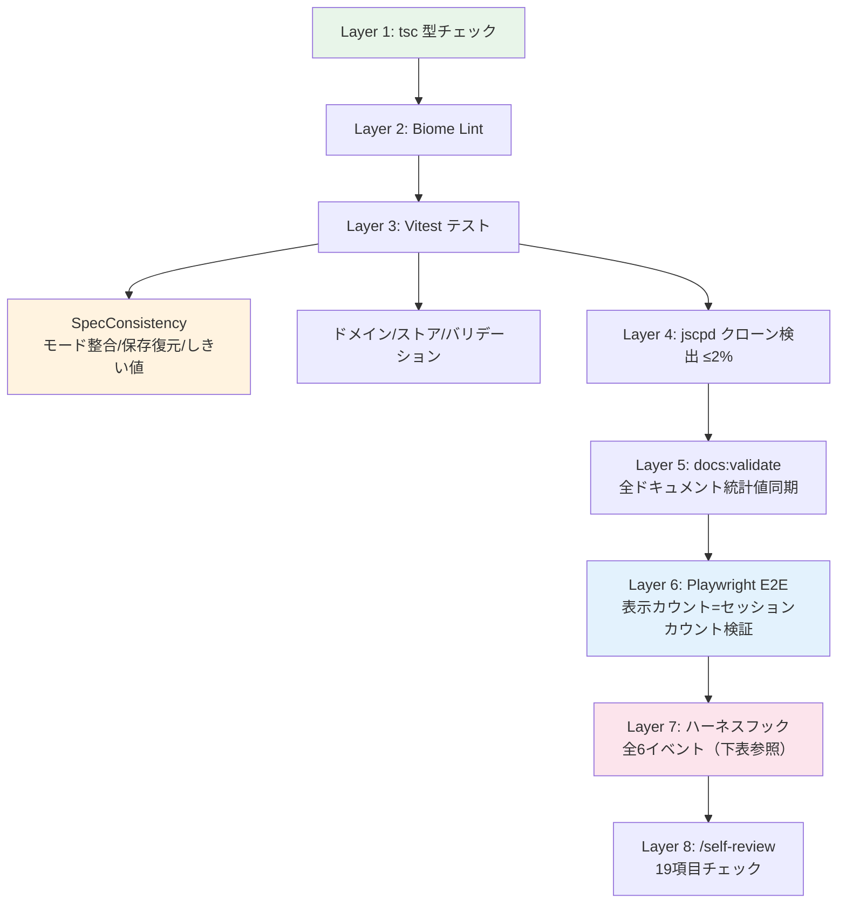

# 仕様バグ防止ガイド

2026-04-06 のセッションで発見・修正した仕様バグのパターンと、再発防止策のまとめ。

## バグパターンと防御策

### 1. UI表示 ≠ コードロジック

**事例:** 「34問が期限到来」と表示して3問しか出ない、「60秒チェック」でタイマーなし

**根本原因:** 表示テキストとセッション開始パラメータが別々に管理されている

**防御策:**
- `SpecConsistency.test.ts` — モード定義の数値整合性を自動検証
- `/self-review` チェック #19 — startSession 呼び出し周辺のUI表示を突合
- **設計原則:** 表示カウントとセッション開始カウントは同じ変数から生成する

### 2. ロジックの分散（コピペ）

**事例:** `!p || p.attempts === 0 || !p.lastCorrect` が6箇所に分散 → 1箇所だけ更新漏れ

**根本原因:** 同じビジネスルールがインラインで複数箇所に書かれている

**防御策:**
- `UserProgress.isCorrectlyAnswered()` — 未正解判定を1メソッドに集約
- `ScoreThresholds.ts` — パッシングスコア(70%)等のしきい値を1箇所に集約
- `jscpd` — `check:all` でクローン率2%以下を自動チェック
- `SpecConsistency.test.ts` — しきい値がハードコードされていないことを検証
- **設計原則:** 3箇所以上で使うロジックはドメインメソッドに抽出する

### 3. 状態の保存漏れ

**事例:** `timeRemaining` が保存されず、実力テスト再開でタイマーがリセット

**根本原因:** `QuizSessionState` に新フィールドを追加した時に `SessionRepository` の更新を忘れる

**防御策:**
- `SpecConsistency.test.ts` — 必須フィールドが SessionRepository と resumeSlice に存在することを検証
- **設計原則:** `QuizSessionState` にフィールド追加時は必ず以下を同時更新:
  1. `SessionRepository.ts` の `SavedSessionData`
  2. `utils.ts` の `saveSessionSnapshot()`
  3. `resumeSlice.ts` の `resumeSession()`

### 4. 用語の不統一

**事例:** 「未回答」と「未正解」が混在、「解答済み」と「正解済み」が混在

**根本原因:** locale 文字列とロジックが別々に変更される

**防御策:**
- locale ファイル（`ja.ts`）に全テキストを集約 — ハードコード禁止
- `/self-review` チェック #18 — ハードコード日本語の自動検出
- **設計原則:** 用語変更は locale → ロジック → テストの3点セットで行う

### 5. UI層にビジネスロジックが漏れる

**事例:** チャプター遷移が QuizCard の useState で管理され、再開時に状態が消える

**根本原因:** ドメイン層で管理すべき状態がコンポーネントのローカルステートにある

**防御策:**
- `SpecConsistency.test.ts` — QuizCard に `useState<Set>` がないことを検証
- **設計原則:** 永続化が必要な状態はドメイン層（`QuizSessionState`）で管理する
- **判断基準:** `useState` で管理する状態が SessionRepository に保存されるべきものなら、ドメイン層に移動する

### 6. 全体像モードの母数不一致

**事例:** Ch.1（5問）を選択したのに36問のセッションが開始される

**根本原因:** `startSession({ mode: 'overview' }, { startIndex })` が全問ロードして途中から開始する設計

**防御策:**
- `startSessionWithIds` でチャプターの問題IDだけ渡す方式に変更済み
- E2E テスト — 「続きから」で正しい問題数になることを検証
- **設計原則:** UIに表示される問題数 = セッションの実際の問題数

### 7. スコア境界値の分散定義

**事例:** `theme.scoreMessages` の `min: 80, 70, 50` と `ScoreThresholds.ts` の `CERTIFICATE_THRESHOLDS.full = 80`, `SCORE_COLORS.good = 70` が独立に定義

**根本原因:** `theme.ts` は domain 層への依存を避ける設計だが、スコア境界値が二重管理になる

**防御策:**
- `SpecConsistency.test.ts` — `theme.scoreMessages` の境界値が `ScoreThresholds` 定数と一致することを検証
- `MASTERY_THRESHOLD` も `ScoreThresholds.ts` に集約済み

### 8. テストのランダム性によるフラッキーテスト

**事例:** `startSession({ mode: 'random' })` でマルチセレクト問題が選ばれた時に `selectAnswer(配列)` が失敗

**根本原因:** テストが `selectAnswer(number)` を前提としているが、ランダム出題でマルチセレクト問題（8問/762問）が混入

**防御策:**
- テストでは `startSessionWithIds(getSingleSelectIds(N))` を使用し、シングルセレクト問題のみでセッション開始
- マルチセレクト対応ヘルパー `answerCurrentQuestion()` は `toggleAnswer` を使用

### 9. JSON.parse の unsafe cast

**事例:** `JSON.parse(stored) as GrowthInsight` で旧バージョンデータの構造不一致が検出されない

**根本原因:** TypeScript の型キャストはランタイムでは無検証

**防御策:**
- `GrowthTrackingService.loadCachedInsight()` — parse 後に必須フィールドの存在チェック
- `GrowthTrackingService.loadHistory()` — `Array.isArray` + `filter` で有効なエントリのみ返却
- `SessionRepository.load()` — 手動バリデーション（既存）

### 10. テレメトリイベントの暴走と silent drop（2026-04-12）

**事例:** Vite HMR の `unhandledrejection`（"send was called before connect"）が `trackError` 経由で 1日 6,705 件 GA4 に送信。DEV と production の区別がなく、レート制限もない。

**根本原因:** エラーハンドラがテレメトリ送信を直接呼び出し、外部要因（HMR 切断、ネットワーク断）の影響を吸収する仕組みがない。

**防御策（多層防御パターン）:**
- **Layer 1 — DEV ガード:** `import.meta.env.DEV` で開発時の送信を完全停止（`src/lib/analytics.ts` `trackError`）
- **Layer 2 — レートリミット:** 同一エラー（`source:message[0:100]`）を 1 分間に 5 件まで（`ErrorRateLimiter` クラス）
- **Layer 3 — Drop 可視化:** ウィンドウごとに 1 回 `app_error_rate_limited` を発火（silent drop の隠蔽防止）
- **Layer 4 — メモリ保護:** リミッター内部の Map は `maxKeys=200` 到達時に lazy GC（長寿命 Electron セッション対策）
- **設計原則:** テレメトリ送信は「production で何が起きても安全」を前提に多層で守る。エラー系は `pushEvent` の GTM_ID チェックだけに頼らない

**観測カバレッジ:**
- データ消失系の `console.error` は `trackError` を併用する（`app_init` / `progress_load` / `progress_save` / `session_save`）
- 観測点が増えてもレートリミッターがあるためログ汚染リスクは低い

**ボット汚染（同セッションで判明）:**
- GitHub Pages の PWA は active users の **約 99% がボット**（2,436 中 `real_user` 検出は 8）
- すべての分析クエリで `customEvent:platform IN ('pwa', 'electron')` でフィルタする
- 詳細: `.claude/skills/analytics-insight/SKILL.md` Step 0
- MCP サーバー（`mcp/ga4-server.mjs`）は `dimensionFilter.values: [...]` で `inListFilter` をサポート

## 品質ゲートの全体構成

### Layer 7: ハーネスフック詳細

| フック | 対象 | 内容 |
|--------|------|------|
| **permissions.deny** | 7パターン | 破壊的コマンドブロック |
| **SessionStart** (15s) | セッション開始 | CI失敗・マージ競合・型エラー・未コミット数 |
| **PreToolUse** (3s) | Bash | Git/SQL/デーモンの危険コマンド事前ブロック |
| **PostToolUse Hook 1** (120s) | Write/Edit | コンポーネント→tsc+SpecConsistency+vitest、locale→日本語スキャン、scripts→構文チェック、docs→validate |
| **PostToolUse Hook 2** (5s) | Write/Edit | QuizMode/UserProgress/ScoreThresholds/SessionRepository/locale 変更時の影響アラート |
| **UserPromptSubmit** (2s) | プロンプト | 2000文字超の分割提案 |
| **Notification** (3s) | 通知 | macOS ネイティブ通知 |
| **Stop** (15s) | セッション終了 | 未コミット・型エラー・lintエラー報告 |

## ハーネスフックの設計原則

- **PreToolUse** は外部スクリプト（`scripts/pre-tool-check.sh`）で stdin をパース。インライン `jq` は stdin 問題があるため使わない
- **PostToolUse Hook 1** は重い処理（tsc + vitest）を並列実行して120秒以内に収める
- **PostToolUse Hook 2** は軽量（5秒以内）で、連鎖更新の見落としを防ぐメッセージだけ出す
- 対象ファイルは `case` 文で分岐し、無関係な編集では何も実行しない
- **permissions.deny** と **PreToolUse** の二重防御で破壊的コマンドを確実にブロック
- 詳細: `.claude/settings.json` の `hooks` セクション

## 新機能追加時のチェックリスト

1. **表示テキスト** → locale ファイルに追加したか？
2. **数値しきい値** → `ScoreThresholds.ts` を参照しているか？
3. **未正解判定** → `isCorrectlyAnswered()` を使っているか？
4. **セッション状態** → `SessionRepository` に保存・復元されるか？
5. **問題数表示** → 実際のセッション問題数と一致するか？
6. **モード定義** → `name` と `description` が実装と一致するか？
7. **新モードID** → `QuizModeId` に追加したら `ALL_MODE_IDS` と `PREDEFINED_QUIZ_MODES` にも登録したか？（未登録だと前セッションの `questionCount` が引き継がれるバグの原因）
8. **SpecConsistency テスト** → 新パターンのテストを追加したか？
