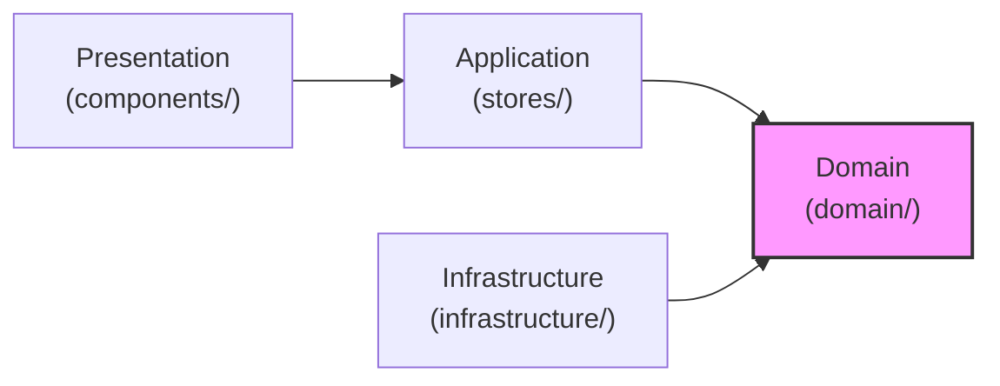
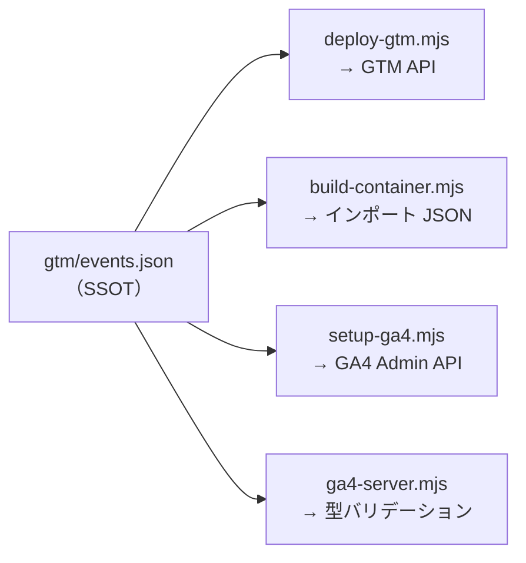
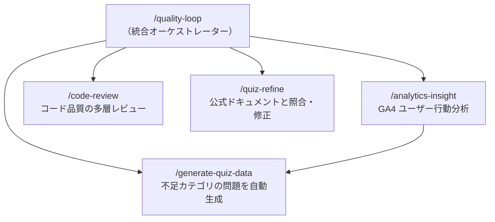

# 設計判断の記録

このプロジェクトで行った主要な技術選定・アーキテクチャ判断の背景と理由。
「なぜこうなっているのか」を将来の開発者（自分含む）が追えるようにするための記録。

---

## ADR-1: PWA + Electron デュアル配信

### 決定

メインの配信手段を **PWA（GitHub Pages）** とし、Electron はデスクトップ用の補助とする。

### 背景

チームに Claude Code を広める学習ツールとして、**導入のハードルの低さ**が最優先。

### 選択肢

| 選択肢 | メリット | デメリット |
|--------|---------|-----------|
| PWA のみ | URL 共有だけで導入完了、更新も自動 | オフラインが弱い（SW で対応可能） |
| Electron のみ | ネイティブ体験、オフライン完全対応 | インストールが必要、配布・更新が手間 |
| **PWA + Electron** | 両方の利点を享受 | ビルド設定が 2 系統必要 |

### 理由

- 「URL を Slack で共有するだけ」で全員が使い始められる PWA が、組織導入には圧倒的に有利
- ただし Electron 版は開発の出発点として先に存在しており、ローカルでの動作確認にも便利
- `src/lib/platformAPI.ts` でプラットフォーム差分を吸収し、コードベースは 1 つに統一
- ビルド設定は `vite.config.ts`（Electron 用）と `vite.config.web.ts`（PWA 用）に分離

---

## ADR-2: DDD レイヤードアーキテクチャ

### 決定

ドメイン駆動設計（DDD）のレイヤードアーキテクチャを採用する。

### 背景

クイズのロジック（出題、スコア計算、SRS、進捗管理）は、UI やストレージの実装に依存すべきでない。PWA と Electron で同じロジックを共有するためにも、関心の分離が必要。

### 構成

### 理由

- **Domain 層が他に依存しない** — ビジネスルール（出題ロジック、SRS アルゴリズム）が UI フレームワークに縛られない
- **リポジトリパターン** — `IProgressRepository` インターフェースを Domain に置き、localStorage 実装を Infrastructure に置くことで、ストレージの差し替えが容易
- **テスタビリティ** — Domain 層は React や localStorage に依存しないため、414 テスト中 314 テストが純粋なドメインテスト
- クイズアプリとしては「過剰設計」に見えるかもしれないが、676 問 × 10 モード × SRS × 進捗管理の複雑さには見合っている

---

## ADR-3: GTM 経由のイベント送信（GA4 SDK 直接ではなく）

### 決定

GA4 へのイベント送信に gtag.js（GA4 SDK）を直接使わず、**Google Tag Manager（GTM）を経由**する。

### 背景

クイズアプリの改善には「ユーザーがどこで離脱するか」「どのモードが使われているか」のデータが必要。しかし、イベント定義は試行錯誤で頻繁に変わるため、フロントエンドのコード変更なしに調整できる仕組みが望ましい。

### 選択肢

| 選択肢 | メリット | デメリット |
|--------|---------|-----------|
| gtag.js 直接 | シンプル、GTM 不要 | イベント変更のたびにコード変更・デプロイが必要 |
| **GTM 経由** | イベント定義の変更が GTM 管理画面 or API で完結 | 初期設定が多い、dataLayer の理解が必要 |

### 理由

- `src/lib/analytics.ts` は `dataLayer.push()` するだけ。どのイベントを GA4 に送るかは GTM 側で制御
- GTM の設定変更は `gtm/deploy-gtm.mjs --apply` でコードベースに触れずに反映可能
- GTM ID を `.env` + GitHub Actions Secret で管理し、リポジトリに秘密情報を含めない
- 将来的に他の計測ツール（Mixpanel 等）を追加する場合も、GTM のタグ追加だけで対応可能

---

## ADR-4: MCP サーバーで GA4 データを取得

### 決定

GA4 のデータを Claude Code から直接クエリするために、**MCP（Model Context Protocol）サーバー**を実装する。

### 背景

品質改善ループ（`/quality-loop`）の中で、「正答率が低いカテゴリの問題を見直す」「離脱率の高いチャプターの UX を改善する」といった判断を、GA4 のデータに基づいて行いたい。そのためには Claude Code が GA4 に直接アクセスできる必要がある。

### 選択肢

| 選択肢 | メリット | デメリット |
|--------|---------|-----------|
| GA4 管理画面で手動確認 | 追加開発不要 | 自動化できない、品質ループが途切れる |
| CSV エクスポート → ファイル読み込み | MCP 不要 | 手動ステップが入る、リアルタイム性なし |
| **MCP サーバー** | Claude Code から対話的にクエリ、自動化可能 | MCP サーバーの実装・保守が必要 |

### 理由

- MCP により Claude Code が「先週のモード別完了率を教えて」のような自然言語の質問に対し、GA4 Data API を直接叩いて回答できる
- `/analytics-insight` スキルが MCP ツールを呼び出し、分析結果を `/quality-loop` の次ステップに渡す一連の自動化が実現
- `mcp/ga4-server.mjs` は 300 行程度の小さなサーバーで、3 ツール（summary / report / realtime）を提供

---

## ADR-5: events.json を Single Source of Truth に

### 決定

`gtm/events.json` をイベント定義の唯一の原本とし、ここから GTM タグ・GA4 ディメンション・MCP サーバーのバリデーションを自動生成する。

### 背景

イベント定義が複数箇所に散らばると、「GTM には追加したが GA4 のカスタムディメンション登録を忘れた」「MCP サーバーのバリデーションが古い」といった不整合が起きる。

### 仕組み

### 理由

- イベントを追加する時の作業が「events.json を編集 → スクリプト実行」の 2 ステップに集約される
- 型の不整合（文字列パラメータを metrics に指定する等）を MCP サーバーが事前に検出してくれる
- `analytics.ts` のトラッキング関数は events.json とは独立しているが、イベント名とパラメータ名を合わせることで暗黙的に連携

---

## ADR-6: Zustand（Redux ではなく）

### 決定

状態管理に **Zustand** を採用する。

### 背景

クイズアプリの状態は「現在の問題」「回答履歴」「セッション情報」「ユーザー進捗」など多岐にわたるが、サーバーサイドの状態同期は不要（全てローカル）。

### 選択肢

| 選択肢 | メリット | デメリット |
|--------|---------|-----------|
| Redux Toolkit | エコシステム充実、DevTools | ボイラープレートが多い、小規模には過剰 |
| React Context | 追加ライブラリ不要 | パフォーマンス問題（再レンダリング）、大規模な状態管理に不向き |
| **Zustand** | 最小のボイラープレート、セレクターで再レンダリング制御、React 外からもアクセス可能 | エコシステムが Redux より小さい |

### 理由

- `create<QuizState>((set, get) => ({...}))` の 1 関数でストア定義が完了。Action Creator や Reducer の定型文が不要
- セレクターパターン（`useQuizStore(s => s.currentQuestion)`）で必要な状態だけを購読し、不要な再レンダリングを防止
- ドメインサービスから `useQuizStore.getState()` で直接アクセスでき、React コンポーネントに依存しないロジックが書ける
- バンドルサイズが小さい（PWA の初期ロード 189KB に貢献）

---

## ADR-7: Biome（ESLint + Prettier ではなく）

### 決定

Lint とフォーマットに **Biome** を採用する。

### 背景

ESLint + Prettier の組み合わせは設定ファイルが多く、プラグイン間の競合も起きやすい。

### 理由

- 1 ツールで lint + format を統一。`.eslintrc`, `.prettierrc`, `.eslintignore` が不要
- Rust 製で高速（`bun run check` が型チェック + lint + 414 テスト + 732 問チェックで約 5 秒）
- ESLint の主要ルールをカバーしており、移行コストが低かった
- `biome.json` 1 ファイルで全設定が完結

---

## ADR-8: Claude Code スキルによる品質自動化

### 決定

クイズの品質維持を Claude Code のカスタムスキル（`/quality-loop`, `/quiz-refine`, `/analytics-insight`）で自動化する。

### 背景

676 問のクイズは Claude Code の公式ドキュメントに基づいているが、ドキュメントは頻繁に更新される。人手で全問題を定期的に検証するのは現実的でない。

### 仕組み

### 理由

- `/quiz-refine` が公式ドキュメントのキャッシュ（`.claude/tmp/docs/`）を使って差分検証を行い、変更があった問題だけを再検証する効率的な仕組み
- `/analytics-insight` が GA4 の実データから「正答率が低すぎるカテゴリ」を特定し、問題の追加・修正の判断材料を自動で提供
- `/loop 1h /quality-loop` で定期実行すれば、ドキュメント更新への追従が自動化される
- スキルの棲み分け: 汎用スキル（`~/.claude/skills/`）にプロジェクト固有の記述を入れず、プロジェクトスキル（`.claude/skills/`）が汎用スキルを呼び出す構成で拡張性を維持

日常的にこれらのスキルをどう使っているかは [Claude Code 活用ワークフロー](claude-code-workflow.md) を参照。
