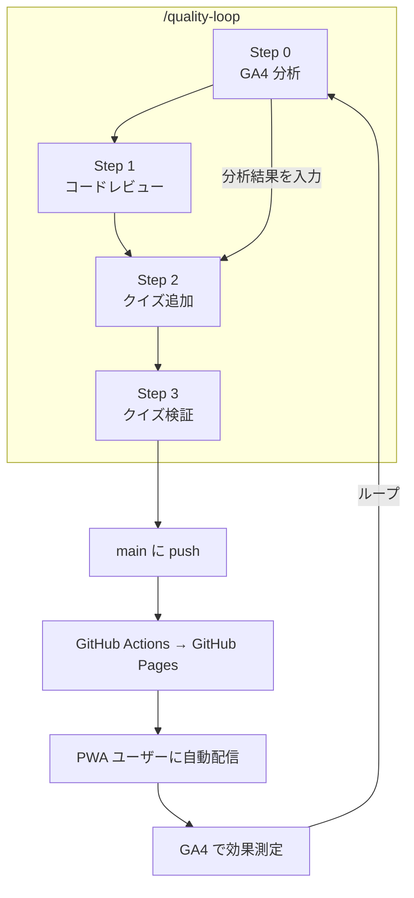

# 品質改善ループ

PWA で配信するクイズアプリの品質を、ユーザー行動データ・コード品質・コンテンツ品質の3つの軸で継続的に改善するフィードバックループ。
日常のワークフローでの使い方は [Claude Code 活用ワークフロー](claude-code-workflow.md) を参照。

## なぜ必要か

PWA は「一度デプロイしたら終わり」ではない。ユーザーのスマホに届いた後も:

- クイズの正答率が低すぎないか（問題の質）
- チュートリアルをスキップして挫折していないか（オンボーディング）
- 公式ドキュメントが更新されて問題が陳腐化していないか（鮮度）
- コードに品質上の問題がないか

これらを定期的にチェックし、改善サイクルを回す仕組みが品質改善ループ。

## 全体像



## 4つのステップ

### Step 0: GA4 ユーザー行動分析（`/analytics-insight`）

PWA ユーザーの行動データを GA4 MCP サーバー経由で取得し、改善ポイントを特定する。

**分析内容:**
- **ユーザーファネル:** PWA アクセス → チュートリアル完了 → クイズ開始 → 完了
- **モード別利用状況:** スマホユーザーは `quick`（60秒チェック）を好むか
- **チュートリアルスキップ率:** 初回訪問者の離脱ポイント
- **チャプター別離脱率:** 全体像モードのどこで挫折するか
- **正答率の偏り:** 特定カテゴリが難しすぎないか
- **app_error イベント:** PWA で発生したエラーの検出（最優先で修正）

**出力:** 改善アクション提案 → Step 2 のクイズ追加判定に入力。app_error があれば Step 1 で最優先修正。

**依存:** GA4 MCP サーバー（`mcp/ga4-server.mjs`）。未接続時は自動スキップ。

### Step 1: コードレビュー（`/code-review`）

未コミットの変更がある場合、4つの観点から包括的にレビューする。複数の専門スキルを統合した多層チェック。

#### a. コード品質（全ファイル）

- 重複コードの抽出・共通化の余地
- 不要な複雑さ（過剰な抽象化、使われていない変数・import）
- 効率の悪いパターン（N+1 的なループ、不要な再計算）

#### b. React + TypeScript パターン検出

`/typescript-react-reviewer` スキルの基準を適用。

**Critical（マージ不可）:**
- `useEffect` で派生状態を計算していないか
- `useEffect` のクリーンアップ漏れ
- 直接的な state mutation（`.push()`, `.splice()`）
- 条件分岐内の Hook 呼び出し
- `key={index}` の動的リスト
- `any` 型の未正当化使用

**High Priority:**
- 依存配列の不備
- `useMemo`/`useCallback` の不要な使用
- Error Boundary の欠如

**Architecture:**
- 300行超のコンポーネント → 分割提案
- 2-3 レベル超の Prop drilling → composition or context
- Zustand store の肥大化チェック

#### c. アクセシビリティ

`/accessibility` スキルの基準を適用。PWA（スマホ利用が主）に特に重要な項目:

- ボタン・リンクのアクセシブルネーム（`aria-label`）
- フォーカス管理（モーダル、クイズ遷移時のフォーカストラップ）
- カラーコントラスト（ダークモード含む）
- キーボードナビゲーション
- `aria-live` によるスコア・フィードバック通知
- タップターゲットサイズ（48px 以上）

#### d. パフォーマンス

`/performance` スキルの基準を適用。PWA の体験に直結する項目:

- バンドルサイズへの影響（新しい import が chunk を肥大化させないか）
- 不要な re-render
- `content-visibility` や仮想スクロールの適用余地
- Service Worker キャッシュへの影響

#### 出力と重大度

| 重大度 | 対応 |
|--------|------|
| Critical | 自動修正。マージ不可の問題 |
| High | 修正案を提示。判断はユーザーに委ねる |
| Suggestion | 報告のみ。「こうするとより良い」レベル |

レビュー結果は観点別に件数を集計して報告:

```
| 観点 | 件数 | Critical | High |
|------|------|----------|------|
| コード品質 | X | Y | Z |
| React/TS | X | Y | Z |
| アクセシビリティ | X | Y | Z |
| パフォーマンス | X | Y | Z |
```

### Step 2: クイズ追加判定・生成

クイズデータの偏りやカバレッジ不足を検出し、必要に応じて新しい問題を自動生成する。

**判定基準:**
| 基準 | 閾値 | データソース |
|------|------|-------------|
| カテゴリ偏り | Weight 15 のカテゴリが全体の 8% 未満 | `quiz:stats` |
| カバレッジ不足 | ドキュメントページが 5問未満 | `quiz:coverage` |
| 正答率の偏り | 特定カテゴリが極端に低い | GA4 分析（Step 0） |
| 新機能対応 | Claude Code ドキュメント更新 | `git diff` |

**生成フロー:** `/generate-quiz-data N` → `quiz:post-add`

### Step 3: クイズ検証・修正（`/quiz-refine`）

全問題を公式ドキュメントと照合し、事実誤りや古い情報を修正する。

**検証内容:**
- 公式ドキュメントとの事実整合性
- 選択肢の正確性
- ドキュメント更新による陳腐化

**差分モード:** 変更があった問題・ドキュメントのみ再検証。全問は `--full`。

## 使い方

```bash
# 全ステップ実行
/quality-loop

# 特定ステップをスキップ
/quality-loop --skip-analytics
/quality-loop --skip-review
/quality-loop --skip-generate
/quality-loop --skip-refine

# ドライラン
/quality-loop --dry-run

# 定期実行（セッション中のみ）
/loop 1h /quality-loop

# 個別実行
/analytics-insight                 # GA4 分析
/analytics-insight 30              # 直近30日
/analytics-insight --focus quiz    # クイズに特化
/code-review                       # コードレビュー
/quiz-refine                       # クイズ検証
/quiz-refine --full                # 全問スキャン
```

## 結果レポート

```
## Quality Loop 結果

| ステップ | 結果 | 詳細 |
|---------|------|------|
| 0. GA4分析 | 完了 | PWAユーザー X人, チュートリアルスキップ率 Y% |
| 1. code-review | スキップ | 未コミットの変更なし |
| 2. クイズ追加 | 追加済み(10問) | 対象: memory +5, tools +5 |
| 3. quiz-refine | 完了 | 658問スキャン, 3件修正 |
```

## 改善サイクルの例

```
1. /quality-loop を実行
   → GA4: 「Ch.3 の離脱率が 40% と高い」
   → クイズ追加: 「tools カテゴリの beginner 問題を 5問追加」
   → quiz-refine: 「ext-029 の Hook イベント数が古い → 修正」

2. git add → commit → push
   → GitHub Actions が自動ビルド・デプロイ
   → PWA ユーザーに Service Worker 経由で自動配信

3. 翌週の /quality-loop
   → GA4: 「Ch.3 の離脱率が 25% に改善」
   → 改善効果を確認
```
