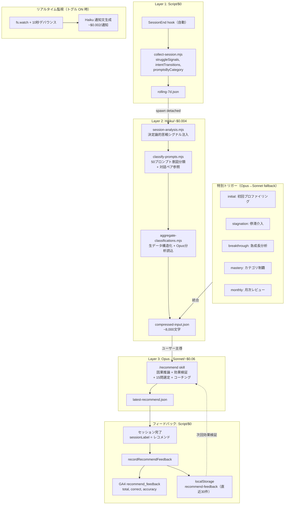
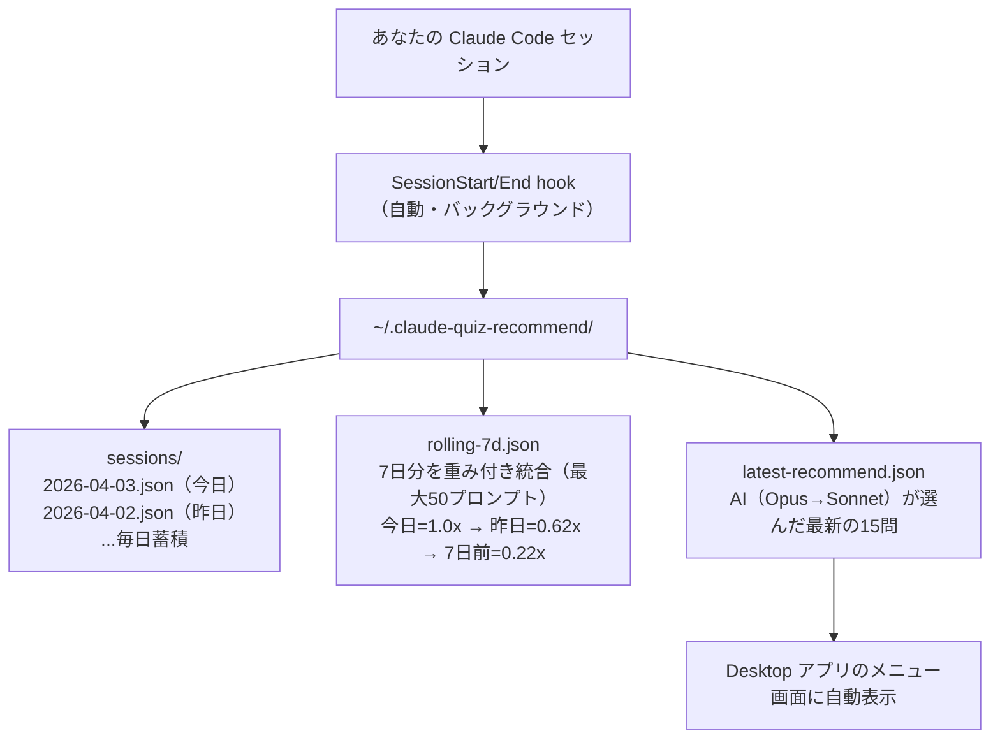
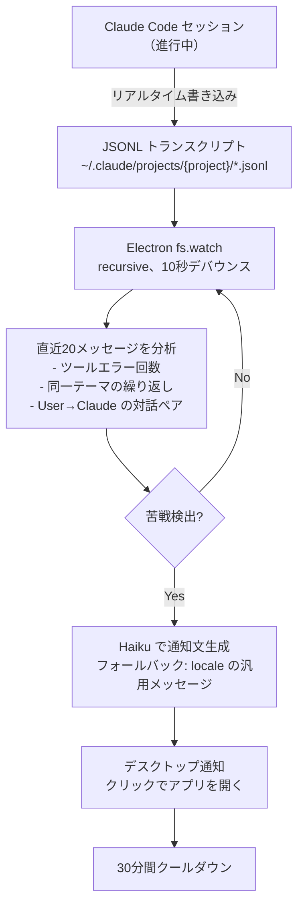
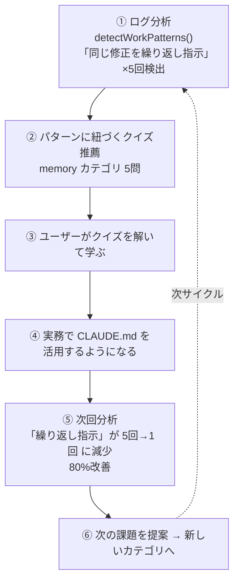

# 利用履歴レコメンド機能（Desktop 限定）

## なぜ Desktop アプリなのか

PWA（ブラウザ版）はどこからでも手軽に使えますが、**ユーザーのローカルファイルにアクセスできない**という根本的な制約があります。

Desktop（Electron）アプリだからこそ可能な体験：

| 機能 | PWA | Desktop |
|------|-----|---------|
| `~/.claude/` のセッション履歴を読む | 不可能 | **可能** |
| Claude Code CLI を呼び出す | 不可能 | **可能** |
| SessionEnd/Start フックの自動設定 | 手動 CLI のみ | **ワンクリック** |
| OS ネイティブ通知 | ブラウザ依存 | **確実** |

この機能の核心は「**作業の文脈を理解した学習**」です。汎用的なクイズを出すのではなく、あなたが今日実際に Claude Code で何をしていたかを分析し、その作業に役立つ知識を問う問題だけを選びます。

## 3層パイプラインアーキテクチャ



**年間コスト:** ~$6（Haiku $2.74 + Sonnet $2.50 + Opus $0.76）

**フォールバック:**
- Opus 利用不可 → Sonnet で自動代替
- Haiku 利用不可 → スキップ（キーワードベース推薦にフォールバック）
- Claude CLI 未インストール → レコメンド機能は無効（クイズ本体は動作）
- オフライン → AI分析不可（クイズは SW キャッシュで動作）

## データ収集の仕組み



## リアルタイムセッション監視

レコメンドカード内のトグルスイッチで有効化できるプロアクティブ機能。
Claude Code で作業中に苦戦を検出すると、デスクトップ通知で関連クイズを提案する。

### なぜ必要か

通常のレコメンドは SessionEnd 後に分析するため、**今まさに困っている瞬間** には間に合わない。
リアルタイム監視は作業中のセッションを直接観察し、苦戦の兆候を検出した時点で通知する。

### 仕組み



### 検出条件

| 条件 | 判定 |
|------|------|
| ツール実行エラーが2回以上 | エラー連鎖。根本原因の理解不足 |
| 直近20メッセージ中、3メッセージで同一テーマを繰り返し | 修正ループ。CLAUDE.md や Hook の活用不足 |
| 8件以上のメッセージ + エラー1回以上 | 長時間の試行錯誤 |

### 設定

| 項目 | 値 |
|------|-----|
| トグル場所 | レコメンドカード下部のスイッチ |
| 永続化 | `~/.claude-quiz-recommend/monitor-settings.json` |
| 起動時 | トグル ON なら Electron 起動と同時に監視開始 |
| 通知クールダウン | 30分 |
| 分析デバウンス | ファイル変更後10秒 |

### 通知からの導線

通知をクリックすると:
1. Desktop アプリが前面に表示される
2. レコメンドセクションが開く
3. 「分析」ボタンを押すと、**現在進行中のセッションも含めて** 最新分析が実行される

### プライバシー

- 監視データは**ローカルの JSONL ファイルを読むだけ**
- 苦戦判定は Electron プロセス内で完結（AI モデル不使用）
- 通知文の生成に Haiku を使用（苦戦検出時のみ、Claude CLI 経由で Anthropic API に送信）
- トグル OFF で即座に監視停止、ファイル監視ハンドルを解放

### セッション開きっぱなし問題の解決

多くのユーザーは Claude Code のセッションを閉じずに放置します。SessionEnd が発火しないため、ログが溜まりません。

**解決策:** SessionStart フックで「今日更新された全セッションファイル」を一括スキャンします。新しいセッションを開いた時点で、開きっぱなしだったセッションの内容もすべて収集されます。

### 複数プロジェクト・複数セッションの統合

`~/.claude/projects/` 配下の**全プロジェクト**のセッションファイルをスキャンします。プロジェクト A で MCP を設定し、プロジェクト B でテストを書いていた場合、両方のコンテキストがマージされたレコメンドが生成されます。

同一セッション ID による重複排除も行うため、2回スキャンしてもデータは二重カウントされません。

## AI による問題選定（`/recommend` スキル）

### なぜキーワードマッチではダメなのか

初期実装ではプロンプト内のキーワードでカテゴリを判定していました。しかし：

- 「スキーマファイルの外部露出リスク」→ キーワード的には `tools` だが、本質はセキュリティの判断力
- 「同じ質問を3回繰り返していた」→ キーワードでは検出不可能。コンテキスト管理の問題
- 「ファイルを1つずつ手動で編集」→ `/batch` を知らないことが本質的な問題

キーワードマッチは「何を使ったか」しか分からない。「何をしようとしていたか」「何に困っていたか」「何を知らなかったか」は AI にしか判断できません。

### `/recommend` スキルの分析パイプライン

`context: fork` で独立サブエージェントとして実行。教育データマイニング研究に基づく4段階の分析を行います。

#### Stage 1: 会話フロー分析

`rolling-7d.json` の `conversationFlows`（セッションごとの時系列プロンプト）を読み、前後関係から作業意図を理解します。

```
例: セッション内のプロンプト列
  1. "このスキーマファイルは外部に露出してる？"
  2. "外部にお渡しするリスクはあるか"      ← 言い換え（回答が不十分だった）
  3. "企業ブロック機能というものもある"     ← 追加情報（文脈を補完）
  4. "では、提案をまとめてください"          ← 丸投げ（判断を委ねた）
```

個別プロンプトではなく **流れ** を読むことで「セキュリティの判断力が不足」「プロンプト設計の問題」と判断できます。

#### Stage 2: 苦戦シグナル検出

2層構造で苦戦を検出します。

**Layer A: 決定論的メトリクス**（`session-analysis.mjs`）

スクリプトが機械的に算出する定量シグナル。Haiku 分類前に「事前分析による苦戦シグナル」としてプロンプトに注入され、AI 分類の精度を向上させます。

| メトリクス | 検出方法 | しきい値 |
|-----------|---------|---------|
| `repeatedPrompts` | 先頭60文字の一致で3回以上繰り返されたユニークプロンプト数 | >= 1 → strong |
| `consecutiveErrors` | 連続するツール実行エラーの最大数 | >= 3 → strong, >= 2 → mild |
| `frustrationHits` | 「エラー」「動かない」「broken」等のキーワード検出数 | >= 3 → strong, >= 1 → mild |
| `resetSignals` | `/clear`, `/compact`, `/rewind` の使用回数 | >= 2 → mild |
| `lengthRatio` | 後半プロンプトの平均長 / 前半の比 | >= 1.8 → mild |
| `level` | 上記の総合判定 | `"none"` / `"mild"` / `"strong"` |

日次の複数セッションは `mergeDailySessions` で集約（sum/max）し、レベルを再計算します。

**Layer B: AI 分類**（Haiku + Sonnet）

教育データマイニング研究（Crossley et al. EDM 2016, Botelho et al. IEEE TLT 2019）に基づく5つのシグナルを、会話の文脈から検出し、強度（低/中/高）を判定します：

| シグナル | 検出方法 | 推薦への変換 |
|---------|---------|------------|
| **Repetition** | 同テーマ3回以上、言い換え | そのテーマの基礎〜中級問題 |
| **Escalation** | 抽象→具体への急変、エラー貼付 | トラブルシュート問題 |
| **Negative** | 「わからない」「できない」の出現 | アンチパターン・よくある間違い問題 |
| **Abandonment** | 未解決のままトピック切替 | 放棄テーマの入門問題 + コンテキスト管理 |
| **Fatigue** | プロンプト短縮化、丸投げ増加 | 効率化・自動化の問題 |

#### Stage 3: 意図遷移パターン

各セッションのプロンプト列をステートマシンにマッピング（Microsoft Research 2020）：

```
探索 → 質問 → 試行 → 修正 → 成功 or 放棄
```

遷移パターンから学習ニーズを判定：

| パターン | 判定 | 推薦 |
|---------|------|------|
| 探索→質問で止まる | 基礎知識不足 | beginner 問題 |
| 試行→修正を3回以上ループ | wheel spinning | bestpractices 問題 |
| 修正→放棄 | 深い知識不足 | intermediate/advanced 問題 |
| 探索→成功（短ルート） | この分野は得意 | 別分野を推薦 |

#### Stage 4: 問題選定

シグナル強度と遷移パターンに基づいて15問を選定：

1. **苦戦への対処（5-7問）** — 検出されたシグナルに直接対応
2. **深い理解（3-5問）** — 使っていたが修正ループが発生した機能
3. **効率化のチャンス（3-5問）** — 手動でやっていた作業を自動化できる機能

### 実際の出力例

```
### 検出した苦戦シグナル
| シグナル | 強度 | 根拠 |
|---------|------|------|
| Repetition | 高 | UI修正を5回繰り返し指示 |
| Fatigue | 高 | 後半「お願いします」が連続 |
| Abandonment | 中 | 法的判断を丸投げして終了 |

### 意図遷移パターン
- Session 1: 探索→試行→修正→修正→修正→成功（3回ループ）
- Session 3: 試行→修正×5（wheel spinning）
- Session 5: 探索→質問→質問→放棄

### 苦戦への対処（6問）
- bp-008: 2回修正しても直らない場合 — Session 3 の修正ループに対応
- bp-036: Claude が同じ間違いを繰り返す場合 — wheel spinning の根本解決
```

## Desktop アプリでの体験

### Kolb の経験学習サイクルに基づく UI 設計

レコメンドカードは教育心理学の「経験学習サイクル」に沿って設計されています：

```
┌─────────────────────────────────────┐
│ ✨ あなたへのレコメンド  16問  🔄 ✕ │
│                                     │
│ ━━━━━━━░░░░░░░░░░░░  35秒          │  ← プログレスバー（再生成中）
│ 使用パターンを分析中 ● ● ●          │  ← ステップ文字（色パルス）
│                                     │
│ ✓ 最新の利用履歴で更新しました  ✕   │  ← 完了バナー（タップで消去）
│                                     │
│ あなたの作業                         │  ← Step 1: 具体的経験
│ ┌─────────────────────────────────┐ │
│ │ 影響範囲はどう考えてますか？    │ │
│ │ 変更を最小限にしたいですけど   │ │
│ │ 大分シンプルに書き直したので   │ │
│ └─────────────────────────────────┘ │
│                                     │
│ ┌─ 振り返り ─────────────────────┐ │  ← Step 2: 振り返り
│ │ テストやレビューに取り組んで    │ │
│ │ いました。もっと効率的なやり方  │ │
│ │ はなかったでしょうか？          │ │
│ └─────────────────────────────────┘ │
│                                     │
│    知っていればもっと早くできた？ ▼   │  ← Step 3: 概念化
│  ┌──────────────────────────────┐   │
│  │ 🔧 Tools  5問               │   │
│  │ 「影響ないんですか？」に関連  │   │
│  ├──────────────────────────────┤   │
│  │ 💡 Skills: スキルを作ると... │   │
│  └──────────────────────────────┘   │
│                                     │
│   ▶ クイズで確かめる（16問）         │  ← Step 4: 実験
└─────────────────────────────────────┘
```

### 更新ボタン（🔄）の動作

1. 確認ダイアログ（iOS スタイルのボトムシート）が表示
2. OK → キャッシュ全クリア（`latest-recommend.json` + `compressed-input.json` + `classified-prompts.json`）
3. 画面がクリアされてプログレスバー付きローディング表示
4. 最新のセッションログから全パイプラインを再実行
5. 完了 → 新しい結果が表示

| フェーズ | 動作 | トークン消費 |
|---------|------|------------|
| 確認 | ConfirmDialog で意図確認 | **0** |
| クリア | 中間ファイル3つを削除 | **0** |
| 再分析 | collect → classify(Haiku) → aggregate → recommend(Sonnet) | **~15K** |
| 完了 | プログレスバー完了 + 新しいレコメンドカード表示 | — |

プログレスバーは漸近的カーブ（90秒で約85%、完了まで100%にならない）で進捗を可視化します。

### トークン節約戦略

| 操作 | Before（Opus） | After（Sonnet） | 節約 |
|------|---------------|----------------|------|
| シャッフル | ~43K tokens | **0 tokens** | 100% |
| 初回分析 | ~43K tokens | ~15K tokens | 65% |
| 選定理由更新 | AI 再生成 | ローカル計算 | 100% |

- **シャッフル**: ローカルで即時再サンプリング（AI 不要）
- **初回/再生成**: Sonnet モデルで実行（Opus の約1/3コスト）
- **選定理由**: プロンプトとカテゴリのキーワードマッチングでローカル生成
- **プロンプト**: `rolling-7d.json` から50件のユニークプロンプトを供給

### 自動レコメンド（パッシブ）

1. Claude Code で作業する（いつも通り）
2. セッション終了時にフックが自動で履歴を収集
3. Desktop アプリを開く → キャッシュからレコメンドカードが即座に表示

### AI レコメンド（アクティブ）

ボタンをタップすると Claude CLI（Sonnet）が `/recommend` スキルを実行：

1. 即座に問題をシャッフル（視覚フィードバック）
2. バックグラウンドで AI が利用履歴を分析（プログレスバー表示）
3. 完了 → 緑バナー + キャッシュ再読込で AI 選定結果に更新

## セットアップ

### ワンクリック（Desktop アプリ）

初回起動時にバナーが表示されます：

> **自動レコメンドを有効にしますか？**
> Claude Code の全セッション終了時にログを収集し、その日の作業に合ったクイズを自動で提案します
>
> [有効にする] [後で]

「有効にする」で `~/.claude/settings.json` にフックが追加されます。

### CLI

```bash
bun run setup:hooks          # フックを追加
bun run setup:hooks --remove # フックを削除
bun run recommend            # 手動でレコメンド生成（CLI）
```

## データの蓄積と減衰

| ファイル | 内容 | 更新タイミング |
|---------|------|-------------|
| `sessions/{date}.json` | 日別のセッションデータ | SessionStart/End ごと |
| `rolling-7d.json` | 7日分の重み付き統合データ（最大50ユニークプロンプト） | 同上 |
| `latest-recommend.json` | AI が選んだ最新レコメンド | `/recommend` 実行時 |
| `localStorage: recommend-feedback` | レコメンドセッションの正誤結果（直近30件） | レコメンドセッション完了時 |

**日別ファイル**は無期限に残ります（手動削除可）。

**rolling-7d.json** の重み付け：

| 日数 | 重み | 意味 |
|------|------|------|
| 今日 | 1.00 | 最も重要 |
| 昨日 | 0.62 | まだ鮮度が高い |
| 2日前 | 0.54 | |
| 3日前 | 0.46 | |
| ... | ... | |
| 7日前 | 0.22 | 参考程度 |

これにより、今日ほとんど作業していなくても過去の文脈が生きます。

## プライバシーとデータ管理

### 保存場所

全てのデータは **`~/.claude-quiz-recommend/`（ホームディレクトリ配下）** に保存されます。

```
~/.claude-quiz-recommend/      ← プロジェクトの外
├── sessions/                  ← 日別セッションデータ
├── rolling-7d.json            ← 7日ローリングキャッシュ
└── latest-recommend.json      ← 最新レコメンド
```

**なぜプロジェクト外か：**
- **git に含まれない** — プロジェクトディレクトリの外なので、誤ってコミット・プッシュされることがない
- **`.gitignore` 設定不要** — そもそも git の管理対象外
- **複数プロジェクト間で共有** — どのプロジェクトで作業しても同じ場所に蓄積される
- **Claude Code の `~/.claude/` と同じ設計思想** — 個人データはホームディレクトリに

### 含まれるデータ

| データ | 内容 | 機密性 |
|--------|------|--------|
| プロンプトサンプル | ユーザーが Claude Code に入力したテキスト（最大50件） | **高** — 業務内容が含まれる可能性 |
| ツール使用統計 | Bash: 573回, Read: 276回 等 | 低 |
| カテゴリスコア | tools: 595, session: 303 等 | 低 |
| トピック | 「MCP」「デバッグ」等のキーワード | 低 |

### 削除方法

```bash
# 全データを削除
rm -rf ~/.claude-quiz-recommend

# 特定の日のデータのみ削除
rm ~/.claude-quiz-recommend/sessions/2026-04-03.json

# フックを停止（データ収集を止める）
bun run setup:hooks --remove
```

### 外部送信

収集されたデータは**ローカルに保存されるのみ**で、外部サーバーに送信されません。ただし `/recommend` スキル実行時に Claude CLI（Anthropic API）にプロンプト内容が送信されます（スキルがプロンプトを読んで分析するため）。

## GA4 トラッキング

イベント `usage_recommend`:

| パラメータ | 値 | インサイト |
|-----------|-----|----------|
| `recommend_action` | `analyze` | レコメンド機能の利用率 |
| `recommend_action` | `view_list` | 問題一覧への関心度 |
| `recommend_action` | `start_quiz` | レコメンド→クイズの転換率 |
| `top_categories` | `tools,session,...` | ユーザーが実際に使う機能 |

イベント `recommend_feedback`（レコメンドセッション完了時に自動送信）:
パラメータ詳細は [analytics-events.md](analytics-events.md#recommend_feedback) を参照。

## ファイル一覧

| ファイル | 役割 | レイヤー |
|---------|------|---------|
| `scripts/collect-session.mjs` | セッション収集 + 前処理（苦戦シグナル・意図遷移・カテゴリ別プロンプト） | Layer 1 (Script) |
| `scripts/classify-prompts.mjs` | Haiku バッチ分類 + aggregate 同期実行 | Layer 2 (Haiku+Script) |
| `scripts/aggregate-classifications.mjs` | 分類結果集計 + compressed-input.json 生成 | Layer 2 内で実行 |
| `scripts/session-analysis.mjs` | セッション分析純粋関数 + 決定論的苦戦メトリクス | Layer 1-2 共通 |
| `src/stores/utils.ts` | `recordRecommendFeedback` — レコメンドフィードバック記録 | Feedback |
| `electron/recommend-handlers.ts` | IPC ハンドラ（DI パターン） | Electron |
| `scripts/recommend.mjs` | CLI レコメンド生成（キーワードベース） | — |
| `scripts/setup-hooks.mjs` | グローバルフックセットアップ | — |
| `.claude/skills/recommend/SKILL.md` | AI レコメンドスキル（Opus→Sonnet fallback） | Layer 3 (AI) |
| `src/components/Menu/UsageRecommend.tsx` | Desktop UI コンポーネント（Kolb サイクル） |
| `src/components/Menu/recommendUtils.ts` | レコメンドロジック（Haiku分類消費、フォールバック推薦、シナリオマッチ） |
| `src/components/Menu/ProgressLabel.tsx` | プログレスアニメーション（パルスドット） |
| `src/components/Menu/UsageRecommend.test.tsx` | ユニットテスト（19テスト） |
| `src/components/Menu/useRecommendation.ts` | 分析状態管理 + 成長追跡統合 |
| `src/domain/services/GrowthTrackingService.ts` | パターン履歴保存・diff計算（メッセージ生成はSonnetに委譲） |
| `electron/main.ts` | IPC ハンドラー（キャッシュ管理、通知、プロセス制御） |
| `electron/preload.ts` | Renderer への API 公開 |
| `docs/usage-recommend.md` | このドキュメント |

## 個人成長追跡（GrowthTrackingService）

### 目的

レコメンド機能の核心は「問題を出す」ことではなく、**ユーザーの使い方が改善しているかを可視化し、次のアクションを提案する**こと。

クイズを解いて学んだ知識が実務に活きているか — このフィードバックループを閉じるのが成長追跡の役割。

### フィードバックループ



### 段階的表示（初見ユーザーに配慮）

| 分析回数 | 表示内容 | UI |
|---------|---------|-----|
| 1回目 | パターン検出 + クイズ推薦のみ | パターンカード + 推薦問題 |
| 2回目 | + コーチング1行 | 「前回と比較できるようになりました」 |
| 3回目 | + 数値付きメッセージ | 「繰り返し指示が改善（80%改善）」 |
| 4回目以降 | + 改善サマリーカード | 改善/次の課題/成熟度を1枚に |

### パターン履歴の仕組み

```
localStorage: claude-code-quiz-pattern-history
├── [0] { date: "2026-03-20", patterns: [...], patternCounts: {...}, maturity: {...} }
├── [1] { date: "2026-03-25", patterns: [...], patternCounts: {...}, maturity: {...} }
├── ...
└── [9] { date: "2026-04-05", patterns: [...], patternCounts: {...}, maturity: {...} }
                                                              最大10スナップショット
```

分析が実行されるたびに `GrowthTrackingService.saveSnapshot()` でスナップショットを保存。次の分析時に `compareWithPrevious()` で前回と比較。

### 比較の3軸

**1. パターンの変化（回数ベース）**

```
前回: { "同じ修正を繰り返し指示": 5, "セッションが長い": 1 }
今回: { "同じ修正を繰り返し指示": 1 }
  → 改善: 「同じ修正を繰り返し指示」80%改善（5回→1回）
  → 改善: 「セッションが長い」解消
  → 新規: なし
```

**2. プロンプト成熟度**

| 指標 | 何を測るか | 良い傾向 |
|------|-----------|---------|
| inquiryRatio | 「なぜ」「仕組み」等の探求系プロンプトの割合 | 増加 |
| specificityRatio | ファイル名・行番号を含む具体的指示の割合 | 増加 |
| avgLength | プロンプトの平均長さ | 30-100文字が最適 |

**3. AI 使用スタイル（Anthropic 研究ベース）**

| スタイル | 検出方法 | 推薦への変換 |
|---------|---------|------------|
| delegation（丸投げ） | 「お願いします」「全部やって」 | beginner 問題で基礎固め |
| debug-delegation | 「直して」「エラーなおして」 | intermediate 問題 |
| inquiry（探求） | 「なぜ」「仕組み」「比較」 | advanced 問題に誘導 |

### コーチングメッセージの生成

コーチングメッセージは **Sonnet が `/recommend` 実行時に生成** する（`coachingMessage` フィールド）。

以前はスクリプト（GrowthTrackingService）が if/else チェーンで固定メッセージを選んでいたが、Sonnet に委譲することで:
- ユーザーの実際のプロンプトを引用した具体的なフィードバックが可能に
- Opus の分析（停滞原因、急成長の因果分析、カテゴリ制覇の関連性）を統合できる
- パターンの変化と学習効果の因果関係を推論できる

GrowthTrackingService はパターンの diff 計算（improved/newIssues/maturityChange.direction）のみを担当し、メッセージ生成は行わない。

### 改善サマリーカード（4回目以降）

```
┌─────────────────────────────────────────┐
│ 📈 あなたの改善レポート                    │
│ ✓ 改善: 同じ修正を繰り返し指示            │
│ → 次の課題: セッションが長い               │
│ 「なぜ」と質問する頻度が増加               │
└─────────────────────────────────────────┘
```

「なぜこの問題？」展開時にはパターンとクイズの紐づけも表示：

```
┌─ memory  5問 ─────────────────────────┐
│ 💡 CLAUDE.md にルールを書けば          │
│   毎回伝える必要がない                  │
│ 「CLAUDE.md を更新して」に関連          │
└────────────────────────────────────────┘
```
